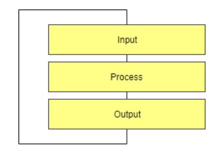
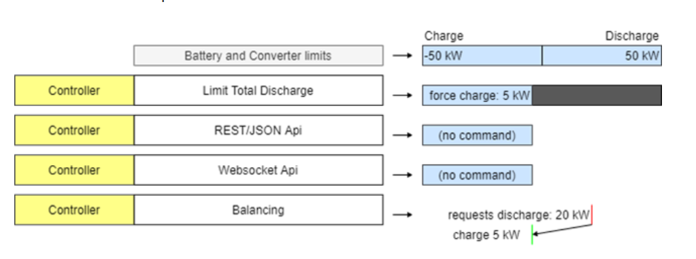
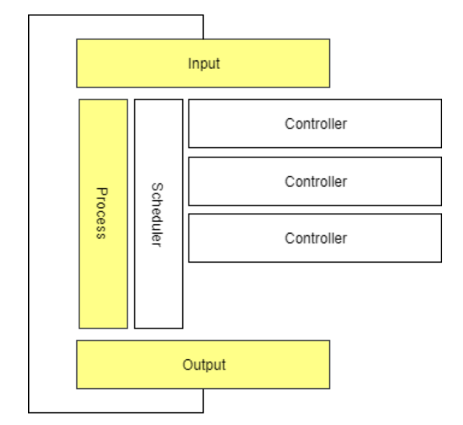
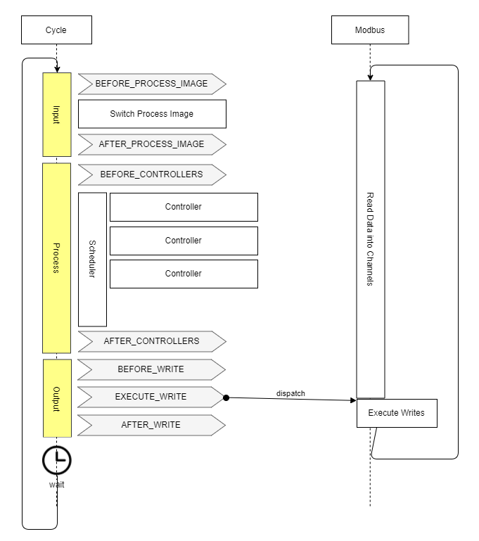
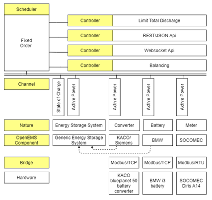

# OpenEMS 

OpenEMS is a modular, open-source Energy Management System (EMS) designed to control, monitor, and integrate energy storage systems with renewable energy sources. The platform comprises three primary components:

- **OpenEMS Edge**: The local interface interacting with the physical environment.
- **OpenEMS UI**: The real-time user interface for monitoring and control.
- **OpenEMS Backend**: The central server for aggregation, monitoring, and control.

## OpenEMS Edge

The OpenEMS Edge functions as the local interface, actively interacting with the physical environment and the OpenEMS Backend. It is built using a high-level programming language and adheres to a three-component architecture: Input, Process (Controller), and Output.

### Architecture

- **Programming Language**: OpenEMS Edge and Backend are implemented in Java, requiring a Java Runtime Environment (JRE) for platform independence. The software typically runs on an Industrial IoT Gateway or a development board like a Raspberry Pi with a GNU/Linux Operating System.

#### Input-Process-Output Model

OpenEMS follows the Input-Process-Output (IPO) model, defining the internal execution cycle:



- **Input**: Collects all relevant information and provides it as a process image.
- **Process**: Runs algorithms and tasks based on the process image information to evaluate whether a digital output should be turned on.
- **Output**: Applies the results from the process phase.

#### The Scheduler

The Scheduler manages the execution of all energy management (EM) algorithms, determining the order and timing of their execution. It uses three major ordering mechanisms:

- Fixed priority order
- Schedule based on a Daily/JSCalendar
- Simple alphabetical execution



The Scheduler resolves conflicts when multiple controllers attempt to set the same output by prioritizing commands.

#### The Controller (Business Logic)

The Controller holds the core business logic and algorithms of OpenEMS that control the hardware. It manages the decision-making process for determining what command should be passed to the hardware.



Controllers operate in two modes:

- **Setpoint Mode**: Calculates a specific, immediate command—the "setpoint"—and sends that value directly to the device for execution.
- **Parameterization Mode**: Transmits configuration parameters or rules to the device, instructing the hardware on how to behave under certain conditions. The hardware then runs its own internal, high-speed control loop based on those parameters.

#### Bridge

In OpenEMS Edge, Bridges are components designed to simplify the implementation and integration of hardware devices that use specific standardized physical connection layers and communication protocols. Essentially, a Bridge handles the low-level communication details, allowing other OpenEMS components (like devices and controllers) to interact with the hardware more easily.

1. Modbus Bridge

The Modbus Bridge supports both Modbus/TCP and Modbus/RTU protocols, commonly used for communication with devices like inverters and meters.

Modbus/TCP: Enables communication over a TCP/IP network.

Modbus/RTU: Facilitates serial communication via an RS485 bus.

The Modbus Bridge manages the execution of Modbus tasks, prioritizing write requests and optimizing read requests to occur just when their values are needed. 

2. HTTP Bridge

The HTTP Bridge is used for devices that communicate via the HTTP protocol, often employing RESTful APIs. This includes various hardware devices like electric meters and relays. 

3. M-Bus Bridge

The M-Bus Bridge supports the M-Bus (Meter-Bus) protocol, a standard for connecting to metering devices such as electricity, gas, or water meters. 

4. OneWire Bridge

The OneWire Bridge connects to devices using the OneWire protocol, commonly found in home automation for sensors like thermometers. OpenEMS's implementation communicates directly with the OneWire bus master (e.g., a USB dongle) and does not require the OneWire File System (OWFS).

#### Process Image

OpenEMS uses a Process Image to maintain data consistency:

- **nextValue**: Holds the latest received data.
- **value**: Holds the stable value used by controllers.

During each cycle, OpenEMS performs a "Switch Process Image" operation that copies `nextValue` into `value`, ensuring that Channel data remains consistent and unchanged throughout the entire calculation cycle.

#### Asynchronous Threads and Cycle Synchronization

OpenEMS communicates with multiple external devices and services, each operating at its own timing and speed. These interactions happen using asynchronous threads, meaning data updates can occur unpredictably and independently of the system’s computing cycle. To maintain data consistency, OpenEMS uses Cycle Synchronization, ensuring that controllers always work with a synchronized snapshot of data for the entire duration of the cycle.



#### Architecture Schema

The OpenEMS Edge architecture is structured to efficiently separate hardware communication from control logic. This design ensures flexibility, predictability, and stability while simplifying the integration of new devices and components. Hardware devices are abstracted using:



### Configuration Management Methods
OpenEMS Edge utilizes the OSGi Configuration Admin Service for configuration management, offering several methods:
- Via OpenEMS UI: Manage configurations through the graphical interface when connected to OpenEMS Edge or Backend.
- Via Apache Felix Web Console: Use the native OSGi method to manage configurations via a web interface.
- Via JSON-RPC: Adjust configurations programmatically using JSON-RPC requests:
<code inline="">createComponentConfig</code>: Create a new component instance from a specific factory.
<code inline="">updateComponentConfig</code>: Modify properties of an existing component instance.
By Editing/Preseeding Configuration Files: Manually edit plain text files on the filesystem for quick changes or initial setups, requiring an application restart to apply.

#### Configuration Architecture Concepts
The configuration structure in OpenEMS Edge is based on four key concepts:

Nature - An interface defining a standard set of characteristics and required channels. 
Channel - A single piece of information about a component, enriched with metadata. 
Factory - A blueprint implementing one or more natures, defining required configuration parameters.
Instance - A runtime instantiation of a factory with a defined set of configuration parameters, uniquely identified by its Component-ID. 

The complete configuration is available via API in a JSON format called the <strong>EdgeConfig</strong>, allowing external services like the OpenEMS UI to adapt to the current setup of OpenEMS Edge.

### Nature

Natures are implemented as OSGi API Bundles and categorize devices and core functionalities. Here are some of the key Natures:

#### ESS (Energy Storage System)

Represents an integrated system comprising a battery and a battery inverter. Implementations include:

- `Ess` (generic)
- `SymmetricEssReadonly`
- `ManagedSymmetricEss` (controllable)
- `EssDcCharger` (solar charger connected to the DC side of an energy storage system)

These implementations require a **State of Charge (SoC)** Channel.

#### Battery / Battery-Inverter

Defines characteristics for the battery cell component and the power conversion unit separately. Used when the battery and inverter are treated as distinct components.

#### Meter

Defines a device that measures electricity flows. Implementations include:

- `ElectricityMeter` (tracks consumption, production, and grid exchange)

#### EVCS (Electric Vehicle Charging Station)

Represents a device for charging electric vehicles. Implementations include:

- `Evcs` (charging station for electric vehicles like e-cars and e-buses)

#### I/O (Digital Input/Output)

Represents hardware components like relays or digital I/O modules. Implementations include:

- `DigitalOutput` (for controlling one or more digital outputs or relays)

#### Predictor

Provides abstract access to time-series predictions. Used by components that forecast energy production or consumption (e.g., LSTM models).

#### Thermometer

Represents a device that measures temperature. Provides temperature data channels.

#### Time-Of-Use Tariff API

Provides a unified interface for accessing energy prices from various providers (e.g., aWATTar). Used for optimizing charging/discharging based on variable pricing.

#### Weather API

Provides a clean interface for accessing historical and forecast weather data. Used for improving PV production predictions.

#### Controller / Scheduler

Represents core system logic components. Used to define and execute control strategies and scheduling tasks.

### Timedata Service

The Timedata Service is essential for data persistence, handling the writing and reading of Channel values to and from a database, thus allowing the system to track performance over time. Its two main functions are:

- **Recording (Write)**: Persistently stores all Channels (e.g., Active Power, State of Charge) with a precise timestamp, often utilizing time-series databases like InfluxDB or optimized methods like RRD4J.
- **History (Read)**: Makes historical data available for the User Interface (UI), which displays charts and graphs; the Backend, which uses aggregated data for centralized monitoring; and Simulation, which feeds historical data to test control algorithms.

## Configuration and Implementation

OpenEMS configuration can be performed through:

- The UI
- The Apache Felix Web Console
- JSON-RPC
- Directly editing configuration files

## Implementing a Device

### Step-by-Step Guide: Implementing a New OpenEMS Device

Implementing a new hardware Device in OpenEMS Edge involves defining, coding, and deploying a new software component (driver) that connects abstract data requirements (Natures) to physical communication protocols (Bridges). This process is generally focused on Modbus communication and encourages the use of abstract base classes for rapid and reliable development.

**Phase 1: Development and Definition**

1. **Create the OSGi Bundle**: The entire device implementation begins by creating an OSGi bundle in Java. This bundle is the self-contained module that will host the driver code and manage its lifecycle within the OpenEMS Edge environment.

2. **Define Dependencies and Configuration**: Specify any required libraries or internal OpenEMS components the device needs to function. Define the required configuration parameters that a user must set (e.g., the Modbus unit ID, IP address, or serial port settings).

3. **Code the Device Class (The Translation Layer)**: Implement the device driver code, focusing on protocol translation logic by:

   * Defining Natures: The device must implement the appropriate Natures (Java interfaces) that define the abstract capabilities of the hardware (e.g., MeterNature or EssNature).
   * Mapping Channels: For every data point required by Nature, map the corresponding Channel to the correct physical address or register required by the hardware's communication protocol.

4. **Unit Testing and Simulation**: Before deployment, validate the device implementation by:

   * Running isolated tests to ensure the mapping and scaling logic is correct and handles edge cases properly.
   * Creating a simulation environment to test the device's behavior within the full Input → Process → Output cycle, without requiring the physical hardware to be connected.

**Phase 2: Deployment and Runtime**

5. **Deployment**: Once tested, deploy the new device support to the OpenEMS Edge instance. This deployment can be handled in two ways:

   - Via the Felix Web Console, which offers a GUI for installing the new OSGi bundle.
   - Via a programmatic API (Application Programming Interface), allowing for automated, remote deployment.

6. **Configuration and Instantiation**: With the Factory for the new device now available in the Edge runtime, a user can create a working instance by:

   - Configuring the device via the UI or console.
   - Creating a runtime Instance, which is the operational copy of the device driver ready to perform its API calls and communication.

## OpenEMS Edge Build Guide

### 1. Building with Eclipse IDE (Manual Development)

1. Open the `io.openems.edge.application` project in Eclipse IDE and open the `EdgeApp.bndrun` file.
2. Press [Export] to start the Export Wizard Selection assistant.
3. Select [Executable JAR] and press [Next >].
4. Select a destination for the export to JAR.
5. Press [Finish].

This creates a "fat JAR" file, including all bundles. It can be executed by running `java -jar openems.jar` in a console.

### 2. Building with Gradle (Automated & Production)

Gradle is a build tool used in the OpenEMS project to compile the JAR files and execute other tasks like building the documentation webpage using Antora and the Javadocs. To build OpenEMS Edge:

1. Open a console and change to your repository directory.
2. Execute `gradlew buildEdge`.

## OpenEMS UI

### 1. Setup Visual Studio Code

1. Download and install Node.js LTS.
2. Download and install Visual Studio Code.
3. Open OpenEMS UI source code in Visual Studio Code:

   - Menu: [File] → [Open Folder…] → Select the `ui` directory inside the downloaded source code.
4. Open the integrated terminal:

   - Menu: [Terminal] → [New Terminal]
5. Install Angular CLI:

   - `npm install -g @angular/cli`
6. Resolve and download dependencies:

   - `npm install`

### 2. Run OpenEMS UI

In Visual Studio's integrated terminal, type:

```bash
ng serve -c openems-edge-dev
```

Open a browser at [http://localhost:4200/](http://localhost:4200).

### 3. Architecture

The OpenEMS UI is a real-time user interface for web browsers and smartphones. It features an Adaptive User Interface, meaning its visualization dynamically adjusts based on the actual configuration of the connected OpenEMS Edge device. It connects to the OpenEMS Edge or OpenEMS Backend via WebSockets for real-time data communication.

### 4. Build OpenEMS UI

The build process is executed using the Angular CLI (`ng build` command). Configuration is specified during the build process to target different environments, such as:

- OpenEMS Edge: `ng build -c "openems,openems-edge-prod,prod"`
- OpenEMS Backend: `ng build -c "openems,openems-backend-prod,prod"`

This process compiles the source code into deployable artifacts that can be run outside of an IDE.

### 5. Implementation Widgets

- **FlatWidget**: the FlatWidget serves as a compact display element that presents essential or general data. It functions as a button that, when interacted with, opens a more detailed ModalWidget. This design pattern ensures a clean and efficient user interface, displaying only critical information at first glance while providing access to detailed views upon user interaction.
- **Modal Widget**: At the time of this documentation, multiple implementations of ModalWidgets exist. However, the unit-testable version is considered the best practice. This approach allows for better testing and validation of the widget's functionality, ensuring reliability and maintainability.
- **Chart**: Charts are primarily utilized in the History View to display historical data. In this context, they should behave similarly to ModalWidgets in the Live View. This means that charts should not be immediately visible in the History View but should open upon clicking on a FlatWidget, providing users with detailed historical data in a modal format.

#### Device Implementations
A **Device** in OpenEMS Edge represents a specific piece of hardware (e.g., battery, inverter, meter) and its corresponding software driver. These devices are categorized by function and include:
### Energy Storage Systems (ESS) / Batteries

**BYD Battery-Box Commercial**

**FENECON Commercial**

**FENECON Home**

- Pylontech Powercube M2
- Soltaro Battery Rack
- KACO blueplanet gridsave
- REFUstore 88K
- Sinexcel Battery Inverter
- Bosch BPT-S 5 Hybrid

#### Meters
- ABB Meters
- Carlo Gavazzi Meters
- Eastron Meters
- Janitza Meters
- Virtual Meters (for calculated values)

#### PV Inverters
- Fronius Inverters
- GoodWe Inverters
- KACO Inverters
- SMA Inverters

#### Electric Vehicle Charging Stations (EVCS)

- Go-e Charging Stations
- Heidelberg Charging Stations
- Webasto Charging Stations
- Open Charge Point Protocol (OCPP) Server Support

#### Relays and I/O Modules

- Shelly WiFi Relays
- Siemens LOGO!
- WAGO Fieldbus Couplers

#### Predictors

- LSTM (Long Short-Term Memory) Models
- Persistence-Model

#### Tariffs

- Tibber Integration
- Awattar Integration
- Manual Tariffs

#### Core Services

These are essential background components that manage the OpenEMS Edge environment itself, rather than external hardware.

Function
ComponentManager - Provides easy access to OpenEMS Components and Channels. It handles the application of default configurations (like APIs) and configuration validation.
Cycle - Provides the core runtime cycle of OpenEMS Edge, dictating when operations (like reading data and executing control logic) occur.
Host - Provides operating system-specific commands, such as configuration of the TCP/IP network.
Meta - Exposes system constants (e.g., software version) as channels, making them available via APIs.
Sum - Calculates and holds aggregated information on energy flows, such as summed production, consumption, and total energy storage charge/discharge.
AppManager / App - Services for managing and running predefined or custom applications within OpenEMS Edge.

#### Edge-2-Edge
<p>This feature allows one OpenEMS Edge instance (**Master**) to connect to and manage devices attached to another OpenEMS Edge instance (**Slave**) via Modbus, enabling distributed or clustered energy management.</p>