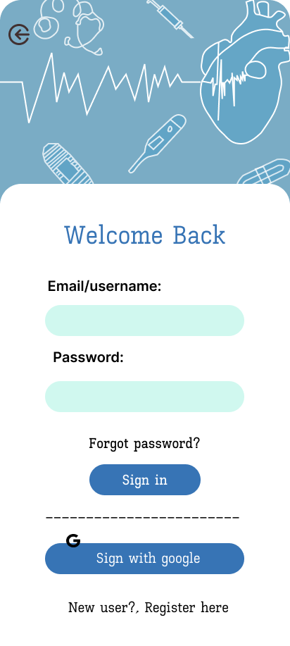
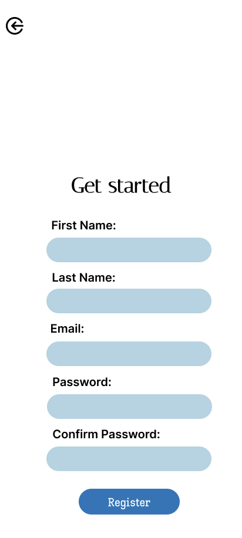

# UI Analysis

## Overview

This document has been updated to present the screens in the flow order . Each section contains the screenshot, a short description, and a detailed analysis covering purpose, key UI areas, interactions, accessibility considerations, and implementation notes.

## Flow order (screens)

1. Android Compact
2. Login
3. Register
4. Patient Page
5. Patient Details
6. Species Details
7. Existing Patients
8. Alert Page
9. Species Details 3
10. Acknowledgement
11. Scan Report
12. Scanned Data
13. Alert Page 3

---

## Screens: detailed view and analysis

### 1) Android Compact

Purpose: compact mobile layout / overview for small-screen devices.

Key UI areas:
- Top bar (title / navigation)
- Compact content cards or list items
- Floating or bottom action bar for primary actions

Visual hierarchy:
- Title/top bar > primary action buttons > content list/cards

Primary interactions:
- Tap to open items, swipe to reveal actions (if supported), bottom action for add/scan.

Accessibility:
- Ensure touch targets >=44px, provide visible focus states, and readable font sizes on small screens.

Implementation notes:
- Use a responsive single-column layout. Implement with a mobile-first CSS approach (Flexbox/Grid).
- Components: TopBar, CompactList, CompactCard, BottomActionBar.

Data & props to expose:
- items: [{id,title,subtitle,status,meta}], onItemPress(id), onPrimaryAction().

### 2) Login

Purpose: Authenticate users to gain access to the application.

Key UI areas:
- Email/username field, password field, primary sign-in button
- Secondary actions: forgot password, register link

Visual hierarchy:
- Primary CTA (Sign in) is visually prominent; inputs stacked vertically.

Primary interactions:
- Form input, show/hide password, disabled state when fields invalid, submit via keyboard.

Accessibility:
- Label every input (aria-label), ensure error messages are announced, use logical tab order.

Implementation notes:
- Validate client-side, show inline errors, and call an authentication API.
- Components: AuthForm, InputText, PasswordInput, Button, Link.

Security notes:
- Avoid logging passwords; use secure storage for tokens and implement server-side rate limiting.

### 3) Register

Purpose: Create new user or patient accounts.

Key UI areas:
- Fields for name, credentials, metadata (e.g., DOB), CTA to submit
- Secondary guidance text and link to login

Visual hierarchy:
- Form fields > primary create/register CTA > secondary links

Primary interactions:
- Form validation, captcha or bot protection, progress indicator on submit.

Accessibility:
- Provide clear field labels and guidance, use aria-describedby for helper text.

Implementation notes:
- Components: RegisterForm, Input, Select, DatePicker, Button.
- Ensure server-side validation mirrors client validations.

### 4) Patient Page

Purpose: Dashboard/listing for a patient — overview of status and recent activity.

Key UI areas:
- Patient summary card, recent events/activity list, primary actions (edit, scan, share)

Visual hierarchy:
- Summary card with key vitals > activity feed > action buttons

Primary interactions:
- Tap to view details, expand/collapse sections, trigger actions (scan/report).

Accessibility:
- Ensure semantic headings and region landmarks; make actions keyboard-accessible.

Implementation notes:
- Components: PatientSummary, ActivityList, ActionStrip.
- Consider lazy-loading heavy sections (charts or reports).

### 5) Patient Details

Purpose: Full detail view for an individual patient record.

Key UI areas:
- Header with patient name and quick metadata (age, ID)
- Tabbed or stacked sections: vitals, history, notes, documents

Visual hierarchy:
- Header > critical vitals > tabs for related data

Primary interactions:
- Edit fields, add notes, attach documents, navigate between tabs.

Accessibility:
- Use aria-labelledby for sections; ensure form controls have labels and error messages.

Implementation notes:
- Components: DetailsHeader, DetailsTabs, EditableField, Timeline.
- Provide optimistic UI for inline edits with background sync.

### 6) Species Details

Purpose: Display details related to a selected species (domain-specific content).

Key UI areas:
- Title, attributes table or cards, images, related records.

Visual hierarchy:
- Title and key attributes > detailed attributes and related items

Primary interactions:
- Expand/collapse attributes, navigate to related items, images modal.

Accessibility:
- Provide descriptive alt text for any images and semantic markup for data tables.

Implementation notes:
- Components: EntityHeader, AttributesGrid, RelatedList, ImageModal.

### 7) Existing Patients

Purpose: Searchable list or index of patients already in the system.

Key UI areas:
- Search/filter bar, list items with summary, pagination or infinite scroll.

Visual hierarchy:
- Search/filter > list > individual item actions

Primary interactions:
- Search, filter, sort, open patient, bulk actions.

Accessibility:
- Ensure list items are accessible as list role; label list controls clearly.

Implementation notes:
- Components: SearchBar, PatientList, PatientListItem, BulkActionBar.
- Use server-side filtering for large datasets.

### 8) Alert Page

Purpose: Surface important alerts or warnings to the user.

Key UI areas:
- Prominent alert header, context/details area, actions to acknowledge or escalate.

Visual hierarchy:
- Alert title > severity badge > details and actions

Primary interactions:
- Acknowledge, dismiss, view history, navigate to affected patient/item.

Accessibility:
- Use ARIA role="alert" for urgent messages; ensure colors are not the only indicator of severity.

Implementation notes:
- Components: AlertCard, SeverityBadge, AlertActions, AlertHistory.

### 9) Species Details 3

Purpose: Variant/detail view of species (different layout or additional fields).

Key UI areas:
- Extended attributes, variant-specific content, attachment area.

Visual hierarchy:
- Key identifiers > extended attributes > attachments/notes

Primary interactions:
- Switch between variants, open attachments, edit metadata.

Accessibility:
- Maintain consistent semantics with the other species page; ensure contrast for variant indicators.

Implementation notes:
- Reuse `SpeciesDetails` components and pass a `variant` prop to toggle layout.

### 10) Acknowledgement

Purpose: Confirmation screen after a completed operation (e.g., registration or report submission).

Key UI areas:
- Confirmation message, reference ID, next steps (buttons/links).

Visual hierarchy:
- Strong success icon/message > reference details > next actions

Primary interactions:
- Copy reference ID, navigate back to dashboard, download receipt.

Accessibility:
- Announce success message via aria-live, include clear copy for screen readers.

Implementation notes:
- Components: SuccessPanel, CopyButton, NextStepsList.

### 11) Scan Report

Purpose: Present results of a scan operation and provide export/share options.

Key UI areas:
- Summary header, result sections (pass/fail), graphs or data tables, export controls.

Visual hierarchy:
- Report summary > critical failures > detailed logs

Primary interactions:
- Expand details, export PDF/CSV, share or flag items.

Accessibility:
- Tables should have proper headers; charts should include text summaries.

Implementation notes:
- Components: ReportHeader, ReportSections, ExportControls, LogViewer.

### 12) Scanned Data

Purpose: Show raw or processed scan data that was captured by the system.

Key UI areas:
- Data table/grid, filters, timestamp and metadata.

Visual hierarchy:
- Filter controls > data table/list > row actions

Primary interactions:
- Filter, sort, view row details, export selected rows.

Accessibility:
- Ensure tabular data has clear headers and keyboard navigation.

Implementation notes:
- Components: DataTable, FilterBar, RowDetailsPanel. Use virtualization for large datasets.

### 13) Alert Page 3

Purpose: Alternate alert view (another severity or context).

Key UI areas:
- Context-specific details, recommended actions, acknowledgment controls.

Visual hierarchy:
- Severity indicator > recommended action CTA > detailed context

Primary interactions:
- Escalate, acknowledge, link to affected entities.

Accessibility:
- Use aria-live and role="alertdialog" if user response is required.

Implementation notes:
- Maintain a consistent alert component API; pass `severity` and `actions` props.

---

## Overall implementation recommendations

- Use a component-driven approach: small, focused components (TopBar, PageShell, DataTable, FormInput, Modal).
- Centralize data fetching (hooks or services) and use caching for lists (e.g., React Query).
- Prioritize accessibility: semantic HTML, ARIA where needed, high-contrast modes, keyboard support.
- For images: consider moving to an `images/` subfolder if you plan to add many more assets; update links accordingly.

If you'd like, I can:
- Move all images into `images/` and update links.
- Rename files to remove spaces and update links.
- Generate a compact gallery view or a printable Markdown/Word-friendly export layout.

---

_Updated: images referenced by their exact filenames in the same folder and screens ordered as requested._
