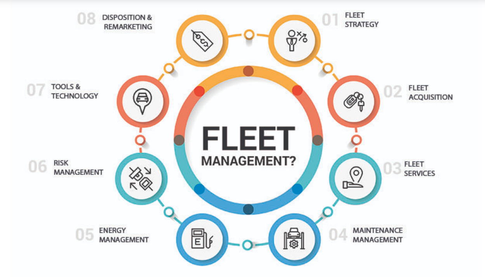
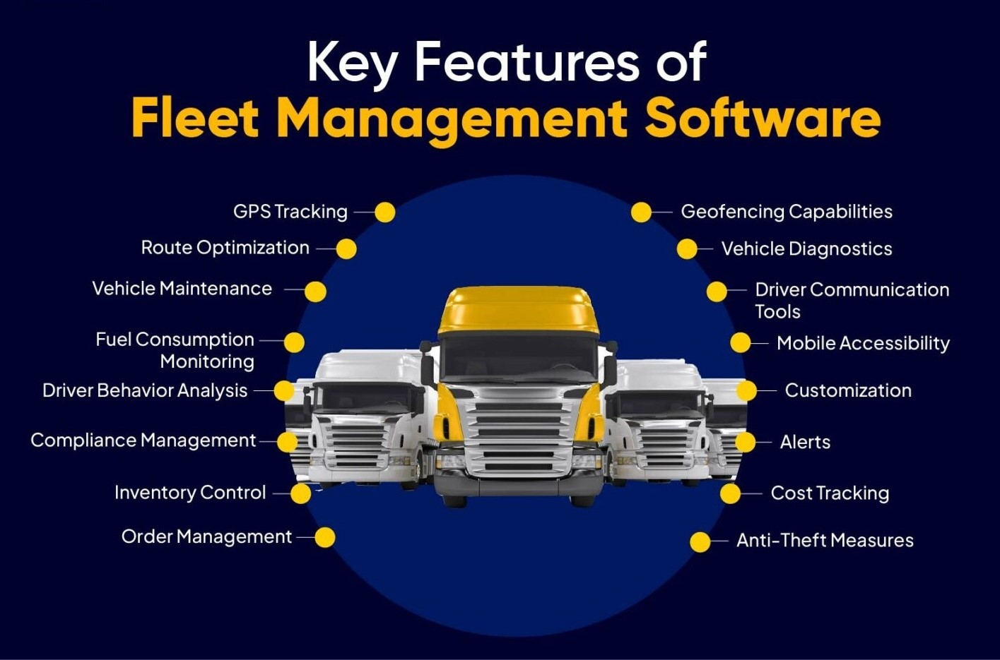

# Fleet Management System

## Introduction to Fleet Management

### 1.1 Definition and Scope
Fleet Management is the integrated process of overseeing, optimizing, and organizing a company's commercial assets—including vehicles, vessels, or aircraft—from acquisition to disposal.  
Its primary objectives are to enhance efficiency, reduce operating costs, strengthen safety, and ensure regulatory compliance.

### 1.2 Key Components of a Fleet
The effectiveness of fleet operations hinges on four interconnected pillars:

- **Vehicles:** The physical assets being managed.  
- **People:** Drivers, mechanics, dispatchers, and management staff.  
- **Processes:** The defined workflows for maintenance, dispatch, and compliance.  
- **Data:** Information gathered via telematics, fuel cards, and inspections, which drives optimization.

### 1.3 Role of the Fleet Manager
The Fleet Manager is responsible for the strategic oversight of the fleet's lifecycle and performance, encompassing:

- **Asset Lifecycle Management:** Vehicle acquisition, utilization, and disposal.  
- **Driver Management:** Training, behavior monitoring, and performance reviews.  
- **Maintenance:** Scheduling, diagnostics, and repair oversight.  
- **Cost Control:** Fuel management and overall budget adherence.  
- **Compliance:** Ensuring adherence to safety and regulatory standards (e.g., HOS, IFTA).

## Fleet Management Modules

1. Vehicle Tracking & Telematics Module  
2. Maintenance & Diagnostics Module  
3. Driver Management & Behavior Module  
4. Compliance & Safety Module  
5. Dispatching & Optimization Module  
6. Fuel Management Module  
7. Analytics & Reporting Module  
8. Integration (API) Module  
9. Inventory Control  

## Fleet Management System Modules

This document structures the FMS content based on the *Key Features of Fleet Management Software*, detailing each feature, its corresponding FMS module/component, and relevant Git repository support.

### 1. Vehicle Tracking & Telematics Module
This module forms the data backbone of FMS, enabling real-time visibility into fleet locations to reduce idle time by up to 20%.

**References:**
- [openvehicles/Open-Vehicle-Monitoring-System-3](url) – Uses OBD-II for metrics like speed and diagnostics.
- [Mobile-Telematics/TelematicsApp-Android](url) – Customizable SDK for GPS collection and geofencing alerts.

**Key Features:**
- **GPS Tracking:** Real-time location monitoring.  
- **Geofencing Capabilities:** Virtual boundary alerts.  
- **Anti-Theft Measures:** GPS-based unauthorized movement detection.

**Sub-Modules:**
- Real-time GPS tracking  
- Geofencing  
- Historical Route Replay  
- Asset Tracking  
- Odometer & Engine Hours  

**Repository Mapping:**
- [openremote/fleet-management](url) (Java) – IoT-based tracking  
- [geotab-drive-windows](url) (HTML) – GPS and telematics integration  
- [samsara-agent-windows](url) (HTML) – Unauthorized movement alerts  
- [Mobile-Telematics/TelematicsApp-Android (Kotlin)](url) – Mobile GPS SDK  

### 2. Maintenance & Diagnostics Module
Preventive maintenance can cut downtime by 30%.  

**References:**
- [prithvisekhar/VehicalDiagnosticAlgo](url) – OBD2 fault detection using phone sensors.  
- [hargata/lubelog](url) – Self-hosted web app for maintenance logs.

**Key Features:**
- **Vehicle Maintenance:** Scheduling, tracking, managing service needs.  
- **Vehicle Diagnostics:** Fault code reading and interpretation.  

**Sub-Modules:**
- Preventive Maintenance (PM) Scheduling  
- Work Order Management  
- Fault Code/DTC Alerts  
- DVIR (Digital Vehicle Inspection Reports)  
- Service History Tracking  

**Repository Mapping:**
- [jmnda-dev/fleetms ](url)(PHP) – Scheduling and work orders  
- [iDharshan/ML-Based-Vehicle-Predictive-Maintenance-System](url) (Python) – AI-based fault prediction  
- [hargata/lubelog ](url)(Go) – Maintenance and fuel tracking  

### 3. Driver Management & Behavior Module
Monitoring behaviors like harsh braking improves safety scores by 15%.

**References:**
- [RaisunLakra/AI-Based-Driver-Behavior-Analysis-System](url) – Video-based behavior scoring  
- [madhurajayashanka/Vehicle_Black_Box](url) – Hardware data logger  

**Key Features:**
- **Driver Behavior Analysis**  
- **Driver Communication Tools**

**Sub-Modules:**
- Driver Scorecards & Gamification  
- In-Cab Coaching/Alerts  
- Dashcam Integration  
- Driver Identification (via Fob/PIN)  
- Driver Document Management  

**Repository Mapping:**
- [Luan220703/Driver-Behavior-Detection](url) (Jupyter)  
- [geotab-drive-windows](url) (HTML)  
- [himloul/Driver-Behavior-Cluster](url) (R)  
- [madhurajayashanka/Vehicle_Black_Box](url) (C++, JS)  

### 4. Compliance & Safety Module
Regulatory adherence avoids fines averaging **$10K** per violation.

**Key Features:**
- **Compliance Management**

**Sub-Modules:**
- HOS / ELD Compliance  
- Accident/Incident Reporting  
- Safety Policy & Training Management  
- Licensing & Registration Management  
- IFTA Fuel Tax Reporting  

**Repository Mapping:**
- [geotab-drive-windows](url) (C#)  
- [samsara-agent-windows](url) (HTML)  
- [openvehicles/Open-Vehicle-Monitoring-System-3](url) (C, C++)

### 5. Dispatching & Optimization Module
Optimization algorithms can save **10–15%** on routes.

**References:**
- [TUM-VT/FleetPy](url) – Dynamic re-routing  
- [alibaba/easydispatch](url) – Real-time assignments  

**Key Features:**
- **Route Optimization**  
- **Order Management**

**Sub-Modules:**
- Route Planning & Optimization  
- Dynamic Scheduling/Re-routing  
- Job/Task Management  
- ETA Sharing  
- Proof of Delivery (ePOD)  

**Repository Mapping:**
- [fleetbase/fleetbase](url) (JS)  
- [aws-samples/delivery-routes-optimization-for-logistics](url) (TS)  
- [tejasvi/routero](url) (Jupyter)  
- [TUM-VT/FleetPy](url) (Python)  
- [alibaba/easydispatch](url) (Python)  

### 6. Fuel Management Module
Fuel accounts for **35% of costs**; tracking idling can save **5%**.

**References:**
- [akhilrex/hammond](url) – Fuel expense tracker  
- [OCA/fleet](url) – Odoo-based integration  

**Key Features:**
- **Fuel Consumption Monitoring**

**Sub-Modules:**
- Fuel Card Integration  
- Fuel Usage & Efficiency Reporting  
- Fuel Level Monitoring  
- Idling Monitoring  
- Bulk Fuel Storage Management  

**Repository Mapping:**
- [jmnda-dev/fleetms ](url)(Elixir)  
- [stefmedjo/fleetmanager](url) (Java)  
- [akhilrex/hammond](url) (Go, Vue, JS)  
- [OCA/fleet](url) (HTML, Python)  

### 7. Analytics & Reporting Module
Custom reports drive **20% better decisions**.

**References:**
- [Fleet-Analytics-Dashboard/Application](url) – Cost analytics  
- [SEA-ME/ME_IoT-Enabled-Fleet-Management](url) – Grafana visualization  

**Key Features:**
- **Cost Tracking**  
- **Customization**  
- **Alerts**

**Sub-Modules:**
- Customizable Dashboards  
- Exception Reporting  
- Benchmark Analysis  
- Fleet Utilization Analysis  
- Predictive Analytics  

**Repository Mapping:**
- [samsara-agent-windows](url) (HTML, CSS)  
- [manju1807/trip-management-app](url) (TS)  
- [UmeshGuptaIndia1994/Vehicles](url) (Java)  
- [Fleet-Analytics-Dashboard/Application](url) (Python)  

### 8. Integration (API) Module
APIs enable **50% faster mobile access**.

**References:**
- [suxrobGM/logistics-app](url) – Transport APIs  
- [googlemaps/last-mile-fleet-solution-samples](url) – Vehicle/task simulation  

**Key Features:**
- **Mobile Accessibility**

**Sub-Modules:**
- Open API Access  
- Accounting/ERP Integration  
- Payroll System Integration  
- External Sensor Integration  

**Repository Mapping:**
- [fleetbase/samsara](url) (PHP, JS)  
- [yugabyte/yb-iot-fleet-management](url) (Java)  
- [teslamotors/fleet-telemetry](url) (Go)  
- [suxrobGM/logistics-app](url) (C#, TS)  
- [googlemaps/last-mile-fleet-solution-samples](url) (Java, Swift, JS)  

### 9. Inventory Control
Efficient inventory reduces part stockouts by **25%**.

**References:**
- [inventree/InvenTree](url) – Full-featured stock tracking  
- [OCA/fleet](url) – Odoo integration  

**Key Features:**
- **Inventory Control**

**Sub-Modules:**
- Parts Inventory Tracking  
- Automated Reorder Alerts  
- Parts Cost Allocation  
- Vendor Management  
- Tire Management  

**Repository Mapping:**
- [fleetbase/fleetbase](url) (PHP)  
- [neuharthr/Fleetco](url) (PHP)  
- [adempiere/adempiereFMS](url) (Java)  
- [inventree/InvenTree](url) (Python/Django)  
- [OCA/fleet](url) (Python)  

## Repository Classification by Language

### JavaScript / TypeScript
- [googlemaps/last-mile-fleet-solution-samples](url) (Java, Swift, JavaScript)
- [hargata/lubelog](url)
- [madhurajayashanka/Vehicle_Black_Box](url) (C++, JavaScript)
- [akhilrex/hammond](url) (Go, Vue and JavaScript)
- [suxrobGM/logistics-app](url) (C#, TypeScript)
- [inventree/InvenTree](url)  
- [aws-samples/delivery-routes-optimization-for-logistics](url)

### Python / Django
- [tejasvi/routero](url) (Jupiter Notebook, python)
- [TUM-VT/FleetPy](url)  
- [OCA/fleet](url) (HTML, python)
- [inventree/InvenTree](url)  
- [alibaba/easydispatch](url)  
- [Fleet-Analytics-Dashboard/Application](url)
