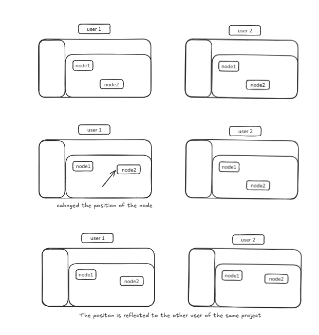
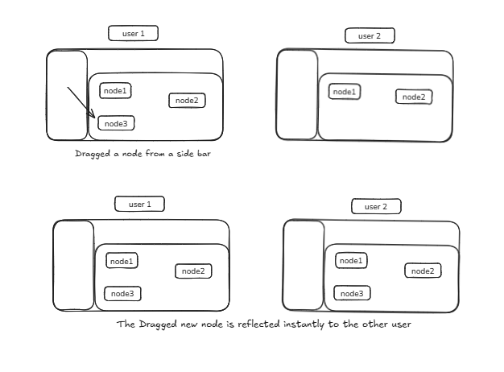

# Supabase Realtime: Node and Edge Broadcasting

### Purpose
When multiple users collaborate on the same canvas (built using React Flow), each user's actions — such as moving a node, adding a connection, or updating a label — need to reflect instantly for everyone.

The Node & Edge Broadcasting System ensures that:
 - Every change in the flow graph is broadcasted in real-time
 - Updates are received and rendered instantly by all collaborators
 - Conflicts and visual "wobbling" during dragging are prevented

### How It Works
Each canvas (identified by fileId and versionId) creates a unique Supabase Realtime channel:
```typescript
canvas-nodes-{fileId}-{versionId}
```

All connected clients join this same channel to:
- Send updates when nodes or edges change
- Receive broadcasts from other users

### Broadcasting Logic
When a change occurs (e.g., node moved, edge added), a broadcast event is sent:

```typescript
type: "broadcast",
event: "NODES_UPDATED",
payload: {
  userId: localUserId.current,
  nodes,
}
```

Similarly for edges:
```typescript
type: "broadcast",
event: "EDGES_UPDATED",
payload: {
  userId: localUserId.current,
  edges,
}
```

#### Payload Details

| Key | Description |
|-----|-------------|
| userId | ID of the user who made the change |
| nodes | Array of node objects (id, position, label, etc.) |
| edges | Array of edge objects (id, source node, target node, etc.) |

The payloads are sent only once per change and not stored in the database — they exist only in real time.

### Receiving Updates
Each client listens for incoming broadcasts from other users.

When a "NODES_UPDATED" or "EDGES_UPDATED" event is received:
- It checks whether the update was sent by the same user
- If yes → ignore it (to avoid echoing back our own updates)
- If no → update the local nodes or edges state accordingly

### Conflict Prevention & Smooth Collaboration

#### The Problem
Without synchronization control, users may experience node wobbling or jittering:
1. You drag a node locally
2. Supabase sends that same node's position back to you
3. React Flow updates again → the node jumps or shakes

#### The Solution
An isDragging flag was introduced to fix this.

#### Implementation Steps
1. A useRef variable tracks drag state:
```typescript
const isDragging = useRef(false);
```

2. Set to true when drag starts and false when drag stops
3. During a drag, incoming broadcasts are ignored:
   - Prevents Supabase from overwriting your in-progress node movement
   - Keeps dragging smooth and purely local
4. After you release the node, the final position is broadcasted to others

#### Result

| Scenario | Behavior |
|----------|----------|
| You drag a node | Local updates only; no Supabase interference |
| Another user drags a node | You receive the update and reflect it live |
| You stop dragging | Your final position is sent to others |

**Outcome:** Smooth, conflict-free node movement across all collaborators

### Key Features

| Feature | Description |
|---------|-------------|
| Real-time Collaboration | All connected clients instantly share node & edge updates |
| No Data Duplication | Your own updates aren't re-applied |
| Conflict Prevention | Drag suppression ensures no visual jitter |
| Scalable Channel Naming | Each fileId + versionId pair isolates collaboration sessions |
| Lightweight Traffic | Only changed states (nodes/edges) are broadcasted once |

### Example Workflow
1. User A moves a node → broadcasts NODES_UPDATED
2. User B receives the payload → updates local React Flow state
3. User A ignores its own broadcast (avoids duplication)
4. Both users see the node in the same final position — perfectly synchronized



