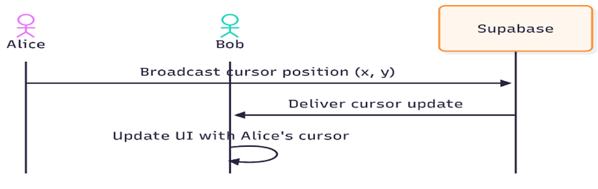
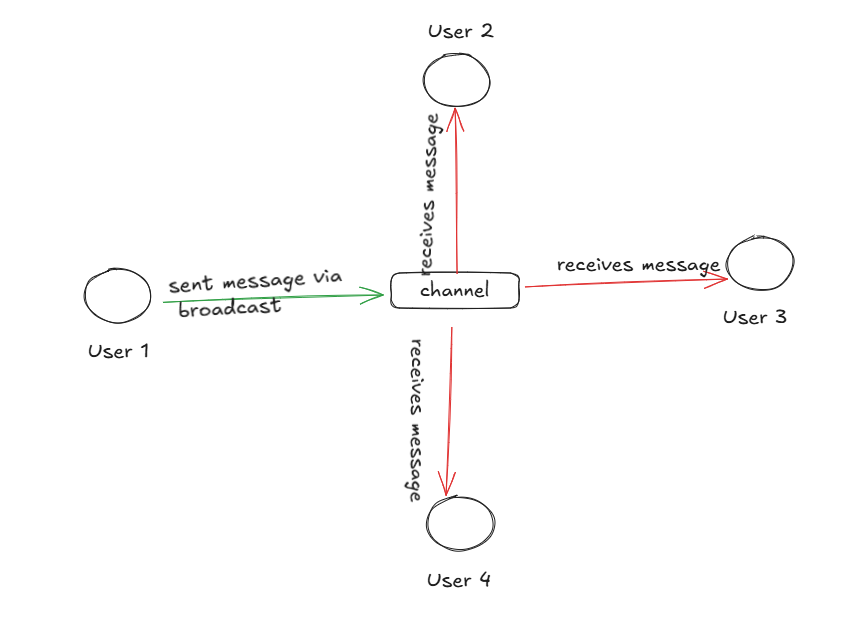
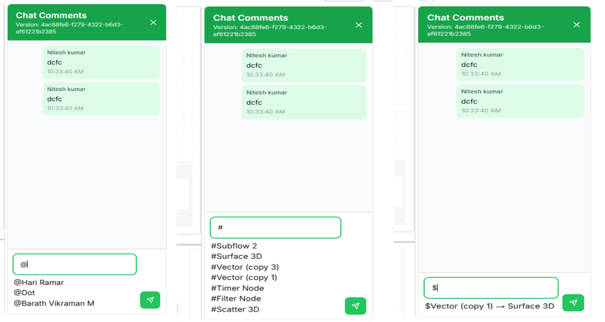
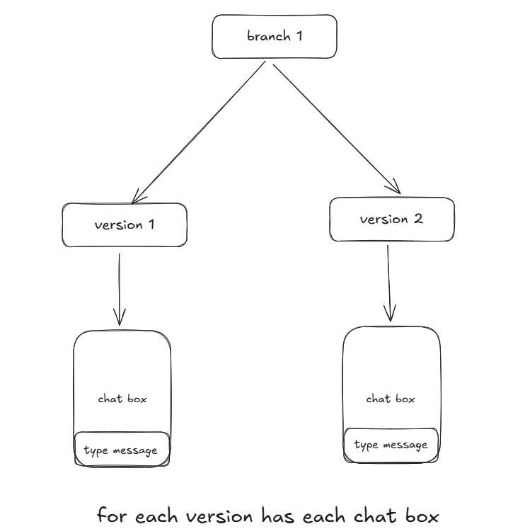

# Live Collaboration (Collaborative Editing)

## Cursor Broadcasting



### Real-time Cursor Updates
```js
supabase.channel('cursor-room').send({
  type: 'broadcast',
  event: 'cursor-update',
  payload: {
    userId: currentUserId.current,
    x,
    y,
    color: userColor.current,
    name: displayName,
    avatarUrl,
    lastUpdated: Date.now(),
  }
});
```

The payload is broadcasted to all users connected to the "channel". The broadcast is sent only once for each change and is not stored.

### Cursor Management Features
- **Receiving and Displaying Cursors:**
  - Subscribes to 'cursor-room' channel from others
  - Updates local state (map of userId → cursor info)
  - Renders a custom cursor on canvas

- **Cursor Timeout:**
  - Uses a timeout to remove cursors if not updated in 50s
  - Prevents ghost cursors from disconnected users

**Example:** When you move your cursor, its position is broadcasted and other users see your live position.

## Nodes and Edges Broadcast

### Node Updates
```js
type: "broadcast",
event: "NODES_UPDATED",
payload: {
  userId: localUserId.current,
  nodes,
}
```

The payload contains userId and nodes data including:
- Node ID
- Position
- Label
- Other node-specific properties

### Edge Updates
```js
type: "broadcast",
event: "EDGES_UPDATED",
payload: {
  userId: localUserId.current,
  edges,
}
```

The payload contains:
- User ID
- Edge data (ID, source node, target node)

### Update Management
- **Receiving Updates:**
  - On node-update, system checks:
    - If current user is dragging that node → Update ignored
    - Otherwise → Node position updated in state

- **Sync & Conflict Prevention:**
  - Implements drag suppression by userId and nodeId
  - Only updates nodes not being dragged by current user

**Example:** When dragging "Node A", other users see fluid synchronized movement. No bounce-back occurs due to suppression of incoming updates during drag operations.


## Collaborative Commenting System

### Overview
This module introduces a context-aware commenting system into the collaborative System Engineering Tool built using Next.js, React Flow, and Supabase. It enables users working on the same projectId and branchId to communicate contextually using structured comments that can reference users and nodes dynamically.

### Objectives
- Allow users to send real-time comments during collaborative sessions
- Enable context tagging using @user and #node patterns
- Display comments immediately to all users in the same project/branch
- Store comments persistently in a database for future reference
- Make the user and node references interactive (e.g., clickable or highlightable)



### Comment Syntax and Structure
Users can type structured messages using the following format:
- `@username`: To mention a user in the project
- `#node_name`: To refer to a node in the flow
- `$edge` : To refer to a edge in the flow
- Plain text for general messages or system-like logs

**Example Comments:**
```
user12 changed this to freeze
@user_001 Can you review this
#node_123 Needs some change
user12 released this branch
```


### System Architecture

#### 🔹 1. Input Parsing
- The system listens for special characters:
  - `@` triggers a dropdown of users in the current project
  - `#` triggers a dropdown of available nodes
  - `$` triggers a dropdown for available edges

- On send, the input is parsed into a structured payload that includes:
  - Content
  - Mentions (list of user IDs)
  - Node references
  - Sender ID
  - Project and branch context
  - Timestamp

#### 🔹 2. Realtime Communication
- Supabase Broadcast is used to emit the comment immediately to other users in the same projectId and branchId
- This ensures that all collaborators receive the message in real time

#### 🔹 3. Persistent Storage
- After emitting the comment, it is stored in the comments table in Supabase for historical retrieval
- This allows users who join later or refresh the page to still see the full comment history

#### 🔹 4. Retrieval and Display
- On project/branch load, comments are fetched from the database
- New comments are also appended via Realtime listeners
- Comments containing @ and # are rendered with stylized components

### Database Structure

#### Table: comment_messages

| Column      | Type        | Description                               |
|-------------|-------------|-------------------------------------------|
| version_id  | UUID / TEXT | Uniquely identifies the version           |
| content     | JSON        | Stores the entire conversation as a JSON object |

#### Example JSON Content
```json
{
  "messages": [
    {
      "message": "This is the first comment",
      "senderId": "user123",
      "timestamp": "2025-09-18T12:00:00Z"
    },
    {
      "message": "This is a reply",
      "senderId": "user456",
      "timestamp": "2025-09-18T12:05:00Z"
    }
  ]
}
```

#### Fields:
- "messages" → an array containing all conversation messages
- Each message entry has:
  - message → the text itself (raw)
  - sender_id → the user who sent it
  - timestamp → when it was sent
- The entire chat history of one version is contained inside a single JSON object in the DB


