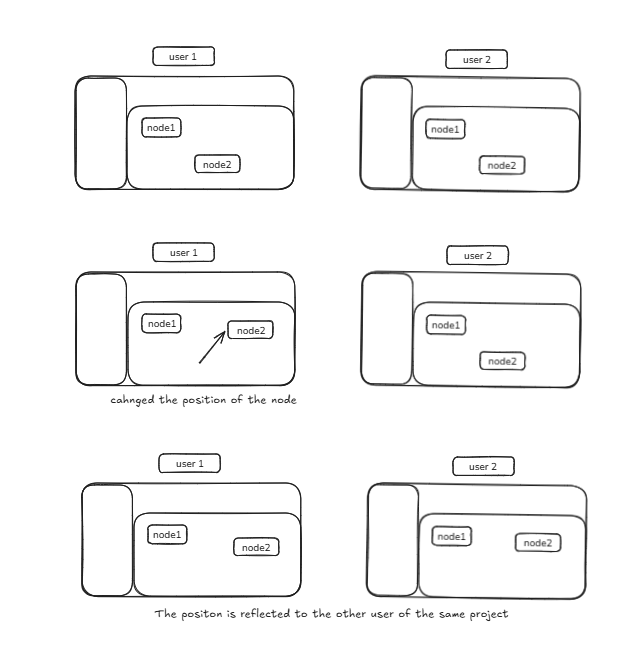
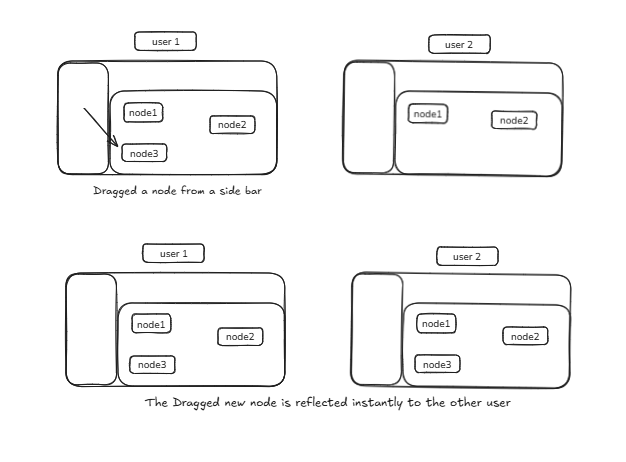

# Live Collaboration (Collaborative Editing)

## Cursor Broadcasting


### Real-time Cursor Updates
```js
supabase.channel('cursor-room').send({
  type: 'broadcast',
  event: 'cursor-update',
  payload: {
    userId: currentUserId.current,
    x,
    y,
    color: userColor.current,
    name: displayName,
    avatarUrl,
    lastUpdated: Date.now(),
  }
});
```

The payload is broadcasted to all users connected to the "channel". The broadcast is sent only once for each change and is not stored.

### Cursor Management Features
- **Receiving and Displaying Cursors:**
  - Subscribes to 'cursor-room' channel from others
  - Updates local state (map of userId → cursor info)
  - Renders a custom cursor on canvas

- **Cursor Timeout:**
  - Uses a timeout to remove cursors if not updated in 50s
  - Prevents ghost cursors from disconnected users

**Example:** When you move your cursor, its position is broadcasted and other users see your live position.

## Nodes and Edges Broadcast

### Node Updates
```js
type: "broadcast",
event: "NODES_UPDATED",
payload: {
  userId: localUserId.current,
  nodes,
}
```

The payload contains userId and nodes data including:
- Node ID
- Position
- Label
- Other node-specific properties

### Edge Updates
```js
type: "broadcast",
event: "EDGES_UPDATED",
payload: {
  userId: localUserId.current,
  edges,
}
```

The payload contains:
- User ID
- Edge data (ID, source node, target node)

### Update Management
- **Receiving Updates:**
  - On node-update, system checks:
    - If current user is dragging that node → Update ignored
    - Otherwise → Node position updated in state

- **Sync & Conflict Prevention:**
  - Implements drag suppression by userId and nodeId
  - Only updates nodes not being dragged by current user

**Example:** When dragging "Node A", other users see fluid synchronized movement. No bounce-back occurs due to suppression of incoming updates during drag operations.

