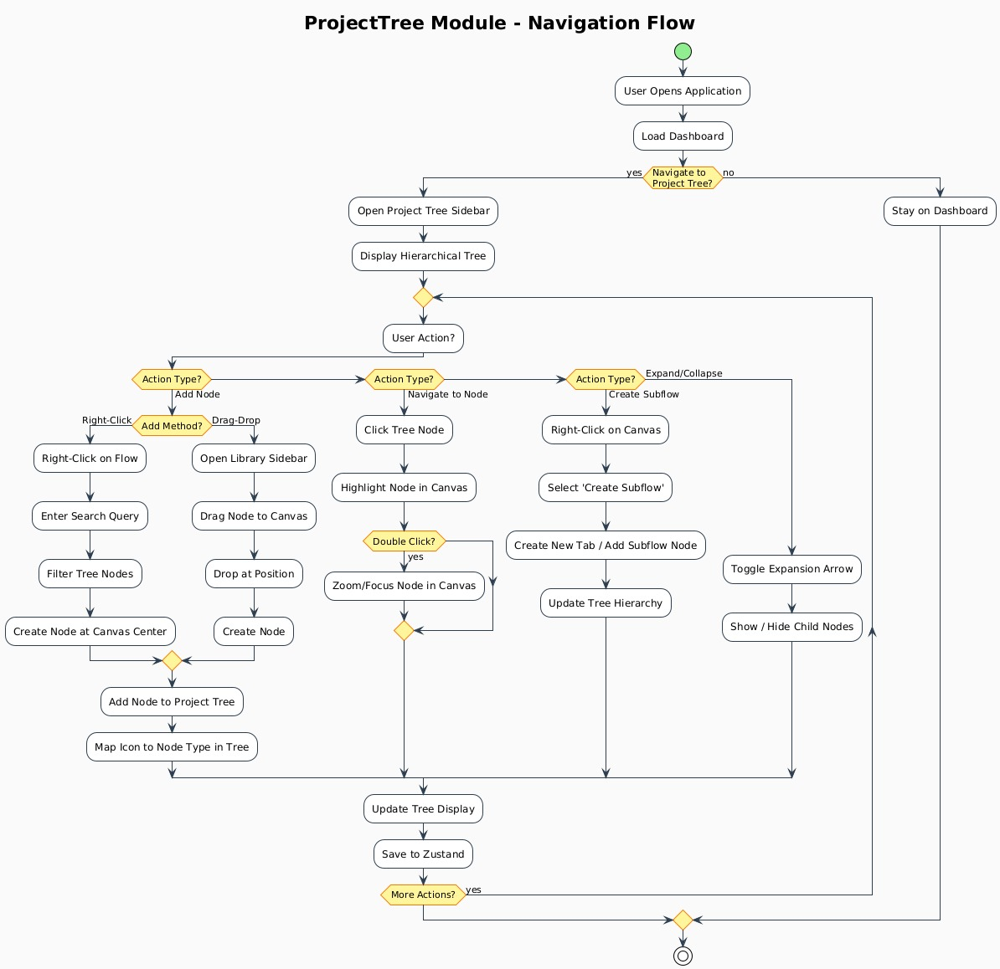

# ESYSFLOW — Project Tree Module


---

## Table of Contents
1. What is Project Tree?
2. Quick Start
3. Key Features
4. User & Data Flow Roadmap
5. File Structure
6. Important Functions & Data Movement
7. Smart Numbering System
8. Two-Way Synchronization
9. Adding New Node Types
10. Navigation Flow of the Module

---

## What is Project Tree?

The Project Tree is your workflow's hierarchical map — a live, interactive outline of all flows, subflows, and nodes in your simulation canvas. It functions as a structural overview similar to a file explorer for engineering logic, where flows act as folders and nodes act as files, with automatic numbering that stays up-to-date. The tree maintains parent-child relationships and displays metadata like node type, label, and associated tab information to enable reliable navigation and verification. It is always synchronized with the Canvas, ensuring that what you see in the tree accurately reflects the current state of your workflow diagram.

---

## Quick Start

For non-technical users, simply open the Project Tree sidebar, expand a flow or subflow, and right-click to add a node or drag from the Library onto the canvas — the interface updates automatically. Technical users should start by examining canvas.tsx for ReactFlow integration, useFlow.tsx for tab and node state management, and projectTreeUtils.ts for tree construction logic. Common operations include right-click addition which creates nodes at the canvas center, drag-drop addition which places nodes at drop coordinates, single-click for highlighting, and double-click for focusing the viewport on the selected node.

---

## Key Features

Right-click node addition provides a searchable context menu that enables fast node insertion tied to the correct tab and parent flow, streamlining the workflow creation process. Drag-and-drop support from the Library allows manual node placement on the Canvas while feeding into the same state management pipeline. The smart numbering system automatically generates stable, readable node ordinals using either visual position analysis or connection topology depending on the workflow structure. Two-way synchronization ensures the Canvas and Tree remain consistent at all times, with built-in utilities handling deduplication and cycle-safe ordering to maintain data integrity.

---

## User & Data Flow Roadmap

### User Journey: What Happens Step by Step?

#### A. Right-Click Add Node

The right-click flow begins when a user right-clicks a flow or subflow in the Project Tree, triggering handleContextMenu() in CustomTreeItem.tsx which passes the event to ProjectTree.tsx and opens a context menu at the mouse position. When the user selects a node type from the menu, handleNodeTypeSelect() validates the selection and calls createNodeDataFromRightClick() to calculate the canvas center position and build the node data object. This node data is then processed by handleRightClickDrop() which creates a new ReactFlow node object with a unique ID, type, position, and default data from graph.json. The new node is added to the correct tab using createSetNodesForTab() which updates the nodes array for that specific tab.

Tab data changes trigger useCanvasEffects.ts which synchronizes the tab data to the ReactFlow canvas state, and then syncs the ReactFlow state back to tab data with flags preventing infinite loops. Finally, the tree rebuilds using buildTree() and mapTreeDataToTreeViewItems() to update the Project Tree UI with deduplication applied, and numbering is recalculated using analyzePositionalHierarchy() or analyzeConnectionOrder() to apply smart numbering based on position or connections.

#### B. Drag & Drop Add Node

The drag-and-drop flow starts when a user drags a node from the Library triggering ReactFlow's drag event, and when dropped on the canvas, the ReactFlow onDrop handler calls the node creation logic. The handleDrop() function creates the node at the drop position, and createSetNodesForTab() updates the tab's node list. Tab data changes trigger the same synchronization pipeline through useCanvasEffects.ts which syncs to both canvas and tree, and buildTree() with mapTreeDataToTreeViewItems() updates the Project Tree UI accordingly.

#### C. Data Conversion & Movement

Node type selection begins as a string value which gets passed to createNodeDataFromRightClick() returning a node data object containing type, label, position, parentId, and targetTabId. This node data object is then converted by handleRightClickDrop() into a ReactFlow node object with properties like id, type, position, and a data payload. The ReactFlow node object is added to the tab's nodes array via createSetNodesForTab(), which then gets synchronized to ReactFlow's nodes state through useCanvasEffects.ts. The ReactFlow nodes state is processed by buildTree() to convert it into a nested tree structure for the UI, and finally mapTreeDataToTreeViewItems() converts this tree structure into UI-friendly format with deduplication applied.

---

## File Structure

```
src/
└── modules/
    └── canvas/
        ├── components/
        │   └── canvas.tsx
        ├── hooks/
        │   ├── useCanvasPage.ts
        │   ├── useFlow.tsx
        │   └── useCanvasEffects.ts
        ├── utils/
        │   └── flowDropHandler.ts
        ├── widgets/
        │   ├── sidebar/
        │   │   └── component/
        │   │       └── sidebar.tsx
        │   └── projectTree/
        │       ├── components/
        │       │   ├── ProjectTree.tsx
        │       │   ├── CustomTreeItem.tsx
        │       │   └── ProjectTreeContextMenu.tsx
        │       ├── hooks/
        │       │   └── useProjectTreeContextMenu.tsx
        │       └── utils/
        │           ├── projectTreeUtils.ts
        │           ├── rightClickUtils.ts
        │           ├── positionalHierarchyAnalyzer.ts
        │           └── flowPositionAnalysis.ts
public/
└── data/
    └── library/
        └── graph.json
```

---

## Important Functions & Data Movement

| Function | File | Trigger | Purpose |
|----------|------|---------|---------|
| handleContextMenu() | CustomTreeItem.tsx | Right-click on tree item | Opens context menu at mouse position and captures target flow/subflow ID |
| handleNodeTypeSelect() | useProjectTreeContextMenu.tsx | Node type selection from menu | Validates selection and orchestrates node creation by calling data builders |
| createNodeDataFromRightClick() | rightClickUtils.ts | After node type selected | Calculates canvas center position and builds node data object with type, label, position |
| handleRightClickDrop() | flowDropHandler.ts | Node data object ready | Creates ReactFlow node with unique ID and applies defaults from graph.json |
| createSetNodesForTab() | useFlow.tsx | Node creation or update | Updates the nodes array for the specific tab in state management |
| buildTree() | projectTreeUtils.ts | Tab data changes | Converts flat node/tab arrays into nested tree structure for UI |
| mapTreeDataToTreeViewItems() | projectTreeUtils.ts | After tree built | Converts tree structure to UI-friendly format with icon mapping and deduplication |
| analyzePositionalHierarchy() | positionalHierarchyAnalyzer.ts | Tree rebuild triggered | Analyzes node positions and generates position-based numbering order |
| analyzeConnectionOrder() | flowPositionAnalysis.ts | Tree rebuild with edges | Performs topological sort based on connections for logical flow numbering |
| useCanvasEffects() | useCanvasEffects.ts | State changes detected | Manages two-way synchronization between Canvas and Tabs with loop prevention |

---

## Smart Numbering System

The numbering system uses two complementary strategies to maintain readable and logical node ordering in the Project Tree. Position-based numbering orders nodes by their visual coordinates on the canvas, scanning from left-to-right and top-to-bottom similar to reading a book, with nodes having similar Y-coordinates grouped together in the same level. Connection-aware numbering follows the logical flow order by performing a topological sort based on node connections, ensuring that source nodes always appear before their target nodes in the hierarchy. The system automatically selects connection-aware ordering when edges exist and the graph is acyclic, falling back to position-based ordering when cycles are detected or edges are absent. Numbering recalculates automatically whenever nodes are added, moved, removed, or when edge connections change, keeping the tree outline accurate and reproducible.

---

## Two-Way Synchronization

Two coordinated React effects maintain consistency between the ReactFlow Canvas and stored tab data to ensure the UI remains in sync at all times. The Canvas-to-Tab effect monitors changes in the ReactFlow state (nodes, edges, viewport) and writes them to the active tab's data structure, using an isReactFlowUpdate flag to prevent triggering the reverse sync. The Tab-to-Canvas effect listens for tab switches or data updates and loads the corresponding tab's data into ReactFlow, using an isTabUpdate flag to avoid circular updates. Both effects employ deep equality checks to verify that actual changes occurred before applying updates, and flags are cleared in the next microtask to ensure clean state transitions. This architecture prevents infinite update loops, reduces unnecessary re-renders, and maintains responsive UI performance even with large projects containing hundreds of nodes.

---

## Adding New Node Types

To add a new node type to the system, first add an entry in public/data/library/graph.json with properties including id, display name, default payload structure, input/output schema, and icon key from the Lucide React library. If the node requires custom rendering or special behavior, register its frontend component ensuring the type property matches the id specified in graph.json. The Project Tree context menu and Library automatically read from graph.json so new entries appear in the UI without additional configuration, though cache refresh may be needed if caching is implemented. Test the new node by using right-click addition from the context menu and drag-drop from the Library, verifying that the correct icon appears in the tree and default values populate properly in the node's data structure.

---


## Navigation Flow of the Module

The navigation flow diagram illustrates the complete user journey through the ProjectTree module from application startup to node management and state persistence. Users begin by opening the application and loading the dashboard, then decide whether to navigate to the Project Tree or remain on the dashboard. Once in the Project Tree, users can perform various actions including adding nodes via right-click or drag-drop, navigating to specific nodes by clicking tree items, searching for nodes using the search query feature, creating subflows through the context menu, deleting nodes from the canvas, and expanding or collapsing tree sections. Each action follows a specific data flow path through the component hierarchy, triggering appropriate state updates and synchronization events. The flow includes decision points for user choices like whether to search before selecting a node type, whether to click on search results, whether to perform more actions after completing one, and whether to save the project before closing. The diagram shows how data moves from user interaction through event handlers, state management, canvas updates, tree rebuilds, and finally to the centralized Zustand store, with proper handling of edge cases and user decisions throughout the entire flow.

---


## The overall  flow of the Project Tree Module



---


