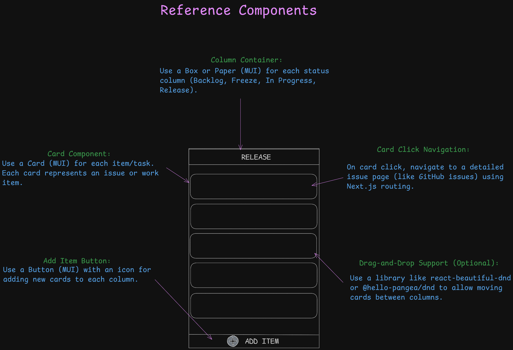
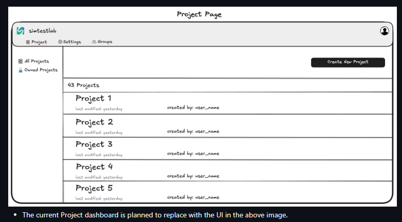
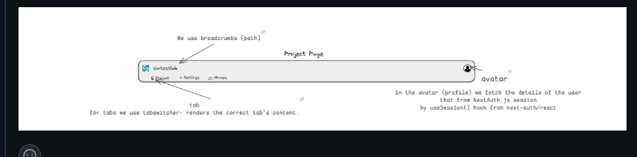
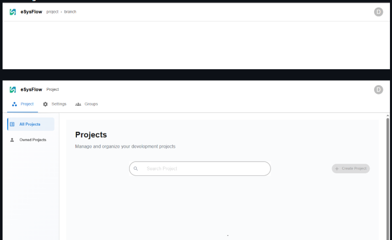
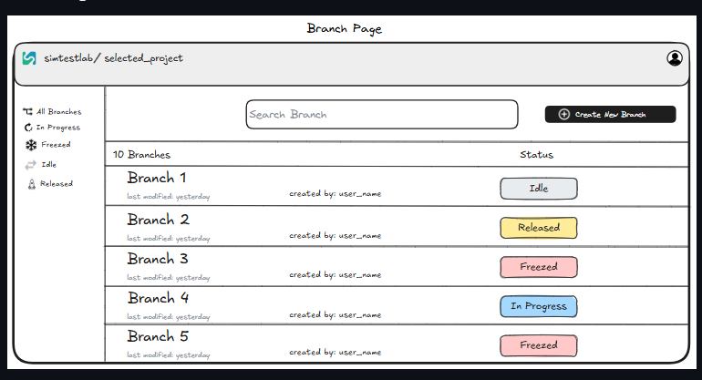

# UI System Analysis 

This document provides a detailed analysis of the user interface (UI) design derived from the provided reference images. The analysis focuses on both the **technical structure (component-level mapping)** and **visual/UX strategy** of the system, highlighting strengths, consistency, and improvement opportunities.

---

## 1. Reference Components Overview

The initial design reference illustrates a **Kanban-style task board** used for managing issues or work items.

### Structural Components
- **Column Container:**  
  Implemented using MUI `Box` or `Paper` components to represent task columns such as *Backlog*, *Freeze*, *In Progress*, and *Release*.
- **Card Component:**  
  Each card represents a work item or issue, implemented using `Card` from MUI. Cards are stackable and visually grouped by status.
- **Add Item Button:**  
  A floating or anchored MUI `Button` with an icon allows adding new tasks to the respective column.
- **Card Click Navigation:**  
  Clicking a card triggers a route transition using Next.js routing to a detailed issue page (similar to GitHub’s issue navigation).
- **Drag-and-Drop Support (Optional):**  
  The design accommodates the integration of libraries such as `react-beautiful-dnd` or `@hello-pangea/dnd` for rearranging cards between columns.
### Visual Design & UX Notes
- Clear, minimalist layout ideal for status-based task visualization.
- Modular design allows scaling by adding columns or modifying card content.
- Simple interaction logic: Add → View → Drag/Move → Update.
- Balanced spacing and use of consistent typography support clarity.
---
---
## 2. Issue Board Interface (Main Issue Page)

This screen represents the **active Kanban board** view within the application.

### Technical Composition

- **Layout:**  
  A responsive grid of four columns (Backlog, Freeze, In Progress, Release). Each is a reusable column component mapped to a defined state.
- **Navigation Bar:**  
  Top bar with:
  - Company title/logo (Simtestlab)
  - Tabs: *Project*, *Settings*, *Issue* 
  - Search field and avatar menu
- **Column Components:**  
  Each column dynamically renders its items (issues) via mapped state arrays.
- **Add Item Buttons:**  
  Located at the bottom of each column, bound to column-specific event handlers for task creation.
### UX Design Observations
- Clear column separation supports visual tracking of work items.
- The consistent “Add Item” placement improves intuitiveness.
- Balanced contrast and use of dark theme offer a professional, developer-oriented appearance.
- Search functionality in the top-right corner adds quick filtering capability.

### Suggested Improvements
- Add hover tooltips for column headers.
- Enable inline editing for card titles to speed up task updates.
- Integrate card status color tags for quick recognition.
---

## 3. Project Dashboard Page (Modern View)

The **Projects** interface offers a structured project management panel.

### Technical Layers
- **Top Navbar:**  
  Features breadcrumb path (`eSysFlow / Project / Branch`) and user avatar fetched via `useSession` (NextAuth.js).
- **Tab Navigation:**  
  Tabs for *Project*, *Settings*, and *Groups*, each switching views using `TabSwitcher`.
- **Main Panel:**  
  Displays a searchable list of projects using MUI `Card` or `Paper` containers with responsive layout.
### UX Analysis
- Clean white theme with excellent content spacing.
- Prominent “Create Project” button improves discoverability.
- Tab system encourages smooth context switching between pages.

### Recommendations
- Add project metadata (owner, updated date, description) under each project card.
- Implement pagination or virtual scrolling for large project lists.

---

## 4. Project Navbar Reference Diagram

This image clarifies the **Project Navbar structure** and its supporting logic.

### Key Functional Components
- **Breadcrumbs:**  
  Reflect the user’s navigation path dynamically using Next.js router.
- **Tabs:**  
  Controlled via `TabSwitcher`, determining which component renders below.
- **Avatar Menu:**  
  Fetches and displays user profile info using `useSession()` from `next-auth/react`.

### Technical Highlights
- All logic encapsulated within a single `index.tsx` file for modular integration.
- Reusable across Project and Branch pages for unified navigation experience.

### UX Considerations
- Intuitive breadcrumb and tab placement at the top enhances orientation.
- Avatar interaction placement follows common user expectations.

---

## 5. Project Page (Redesigned View)

This updated Project Page layout presents projects as a scrollable list.

### Technical Mapping
- **Sidebar Navigation:**  
  Options for *All Projects* and *Owned Projects* implemented via MUI `List` components.
- **Main Area:**  
  Each project displayed as a styled card within a scrollable container.
- **Action Button:**  
  “Create New Project” button positioned on the top-right corner with MUI’s `Button` variant.

### UX Evaluation
- Improved readability compared to the older dashboard.
- Consistent alignment between list items maintains structure.
- The new layout aligns with modern dashboard conventions.

### Suggested Enhancements
- Include visual project icons or status indicators.
- Enable quick-access dropdowns for project actions (Edit, Delete, Open).

---

## 6. Branch Page
 
 The Branch Page extends the Project layout to show branch-level data.

### Component Structure
- **Sidebar:**  
  Filter-based navigation (All Branches, In Progress, Released, etc.).
- **Search Field:**  
  Allows filtering branches by name or status.
- **Branch List:**  
  Each branch card displays metadata (created by, last modified) and colored status badges.
- **Action Button:**  
  “Create New Branch” positioned on the top-right for immediate interaction.

### UX Design Review
- Well-defined visual hierarchy supports task discovery.
- Color-coded branch status (Idle, Released, Freezed, In Progress) effectively conveys workflow state.
- Retains consistency with the overall Project and Issue pages.

### Improvements
- Consider inline branch editing for renaming.
- Add hover preview for branch details (e.g., commit summary or owner info).

---

## 7. Overall System Evaluation

### Strengths
- Consistent component structure across all modules.
- Cohesive design language between Project, Branch, and Issue views.
- Strong modularity through MUI and Next.js integration.
- Scalable architecture suitable for multi-project environments.

### Areas for Enhancement
- Improve microinteractions (hover, drag animations).
- Add responsive testing for small-screen layouts.
- Standardize spacing and typography for pixel-perfect alignment.

### Conclusion
The UI system demonstrates a **modern, scalable, and developer-friendly** interface built with reusability and modularity in mind. It effectively integrates documentation-style clarity with functional design, making it suitable for professional-grade engineering management platforms like eSysFlow.

---
