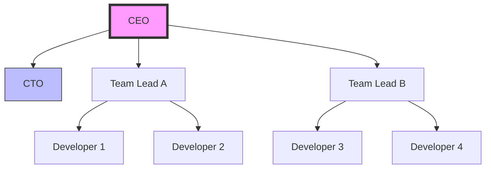

# Our Organization

## Team Structure

Meet the Team

{ width=140 .rounded }
Alice Smith
CEO
Leads the company’s vision, strategy, and partnerships.

{ width=140 .rounded }
Bob Johnson
CTO
Oversees technology roadmap and product engineering.

{ width=140 .rounded }
Charlie Lee
Team Lead A
Manages the platform engineering team and core services.

{ width=140 .rounded }
Dana Wong
Team Lead B
Heads application development and delivery pipeline.

{ width=140 .rounded }
Ethan Patel
Developer
Focused on backend services and APIs.

{ width=140 .rounded }
Fatima Khan
Developer
Works on frontend, UX, and customer-facing features.

 