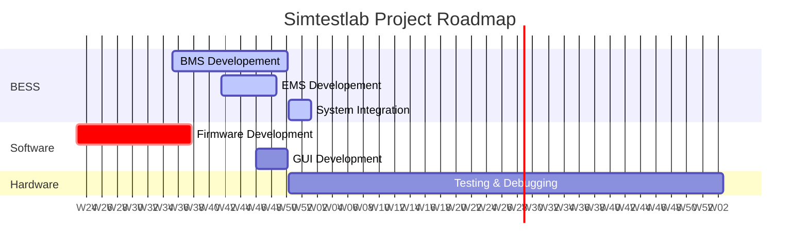

## Project Roadmap

```mermaid
gantt
    dateFormat  YYYY-MM-DD
    title Simtestlab Project Roadmap
    axisFormat  W%U
    tickInterval 2week
    section BESS
    BMS Developement      :active, 2025-09-01, 2025-12-15
    EMS Developement      :active, 2025-10-16, 2025-12-05
    System Integration      :active, 2025-12-16, 2026-01-05
    section Software
    Firmware Development :crit,12, 2025-06-06, 15w
    GUI Development      : 2025-11-16, 2025-12-15
    section Hardware
    Testing & Debugging  : 2025-12-16, 2027-01-15
```

*Note: The timeline is subject to change based on project requirements and resource availability.*

