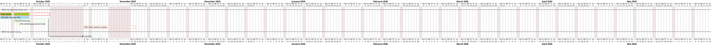

```puml
@startgantt
<style>
ganttDiagram {
  task {
    BackGroundColor yellowgreen
    LineColor red
  }
  done {
    BackGroundColor #80FFFFFF
  }

}
</style>
printscale daily
sunday are closed
Project starts 2025-10-01
today is colored in red
' Long timeline to demonstrate scrolling
-- BMS Harware developement --

[First version ] as [P1] requires 16 days and is 60% complete 
[FALCON -Generic ECU] as [bmshw1] requires 16 days and is 60% complete 
[FALCON-Routing] as [bmshw2] requires 10 days and is 0% complete 
[AFE:Cell Meausurement Unit] as [bmshw3] requires 1 days and is 0% complete 
[AFE: Pack monitor system] as [bmshw4] requires 10 days and is 0% complete 

-- BMS Harware Testing --
[FALCON] as [FALCON] requires 5 days and is 0% complete 

[bmshw1] starts at [P1]'s start
[bmshw2] starts at 2025-10-05
[bmshw3] starts at 2025-10-07
[bmshw4] starts at 2025-10-31

[FALCON] starts at [bmshw1]'s end

[bmshw1] is colored in LightBlue
[bmshw2] is colored in LightGreen
[bmshw3] is colored in Gold
[bmshw4] is colored in Coral
[FALCON] is colored in LightBlue

'holidays
2025-10-20 to 2025-10-30 are closed
2025-11-10 to 2025-11-15 are closed


@endgantt


```

