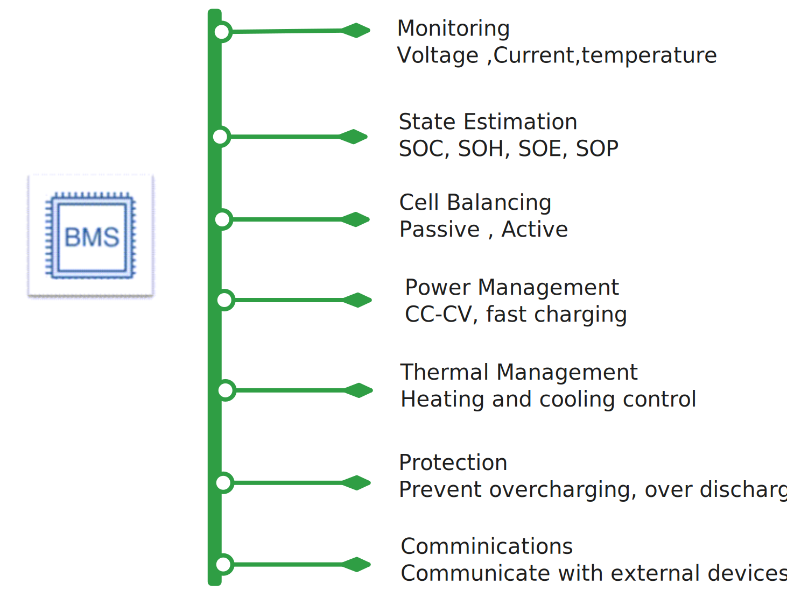
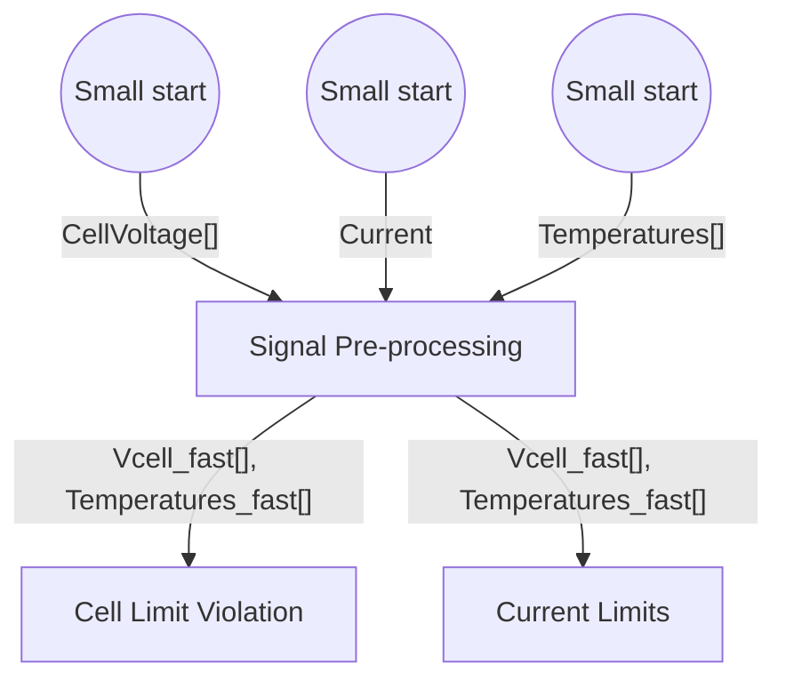

## Core BMS functions

## Software Architecture  

```mermaid
  flowchart TB
  SPP[Signal Pre-processing] -- Vcell_fast[], Temperatures_fast[] --> CLV[Cell Limit Violation]
  SPP[Signal Pre-processing] -- Vcell_fast[], Temperatures_fast[] --> CL[Current Limits]
  CV((Small start)) -- CellVoltage[] --> SPP
  I((Small start)) -- Current --> SPP
  Temp((Small start)) -- Temperatures[] --> SPP
```
