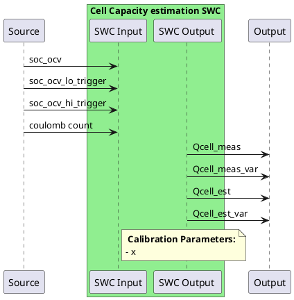

# Capacity Estimation

When working with aged cell the capacity estimation is crucial in estimating the true capacity a given cell can retain. A wrong capacity will lead to a large couloumb counting deviation and therefore Soc.
This estimation function can be broken down into two parts, a measurement part and a filtering part.
The measurement part is triggered when some conditions are met and returns a "measured" value of the capacity. This measurement is then fed into a filter that slowly updates the stored value (NVRAM).
The stored value is then used by all other software components.

## 1. Capacity measurement

The below requirements a. & b. need to be fulfilled for the function to be enabed.

### a. Low resting Ocv based Soc
This function shall be triggered when the battery cells get an Soc Ocv update from the lower region (see LFP_Soc specification).
The function shall stored this value as soq_soc_lo for each cell.
The function shall also keep a value of the current coulomb count value, soq_cc_lo.

### b. High resting Ocv based Soc
The function shall trigger the next step, whenever it has got an updated Soc Ocv from the higher region (see LFP_Soc specification).
The function shall stored this value as soq_soc_hi for each cell.
The function shall also keep a value of the current coulomb count value, soq_cc_hi.

### c. Measurement calculation
Once a. and then b. have been fulfilled, the capacity measurement for each cell can be expressed as:
Qcell_meas = (soq_cc_hi - soq_cc_lo) / (soq_soc_hi - soq_soc_lo)

