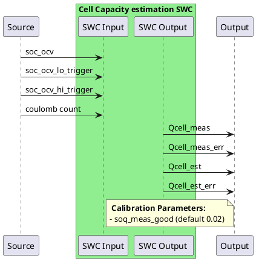

# Capacity Estimation

When working with aged cell the capacity estimation is crucial in estimating the true capacity a given cell can retain. A wrong capacity will lead to a large couloumb counting deviation and therefore Soc.
This estimation function can be broken down into two parts, a measurement part and a filtering part.
The measurement part is triggered when some conditions are met and returns a "measured" value of the capacity. This measurement is then fed into a filter that slowly updates the stored value (NVRAM).
The stored value is then used by all other software components.

## 1. Capacity measurement

### a. Low resting Ocv based Soc
This function shall be triggered when the battery cells get an Soc Ocv update from the lower region (see LFP_Soc specification).
The function shall stored this value as soq_soc_lo for each cell.
The function shall also keep a value of the current coulomb count value, soq_cc_lo.
The function shall store a value of the start (or trigger) time soq_t_lo.
Once this function gets activated, the BMS shall keep track of the maximum and minimum current values, resp. soq_i_max, soq_i_min until b. is activated.

### b. High resting Ocv based Soc
The function shall trigger the next step, whenever it has got an updated Soc Ocv from the higher region (see LFP_Soc specification).
The function shall stored this value as soq_soc_hi for each cell.
The function shall also keep a value of the current coulomb count value, soq_cc_hi.
The function shall keep track of the time soq_t_hi.

### c. Measurement calculation
Once a. and then b. have been fulfilled, the capacity measurement for each cell can be expressed as:
deltaCoulomb = (soq_cc_hi - soq_cc_lo)
Qcell_meas = deltaCoulomb / (soq_soc_hi - soq_soc_lo)

### d. Error calculation
In order to estimate an measurement error, one wants to know what the average current (C-rate) was during the charging phase, and what the minimum and maximum current were.
The average current (charging C-rate) can be derived by soq_c_rate = deltaCoulomb / (soq_t_hi -soq_t_lo).

By default, the Qcell_meas_err is = soq_meas_good*Qcell_meas (2% of Qcell_meas).
However, this assumes that all the below conditions have been met. If one of the below condition is not met, a penalty is added on top of soq_meas_good.
- If soq_c_rate is contained between +C/3 and +C, otherwise additional penalty of 5%.
- If soq_i_min >= 0 and soq_i_max < 2C, otherwise additional penalty of 5%.
- If soq_i_min < -C/3 add an additional penalty of 10%.

## 2. Capacity filter
The filter shall retrieve the capacity stored in NVRAM for each cell Qcell_est with their resp. error Qcell_est_err.
Note: the initial values of Qcell_est and Qcell_est_err stored in NVRAM are resp. the cell capacity nominal value and half of the cell capacity nominal value.
