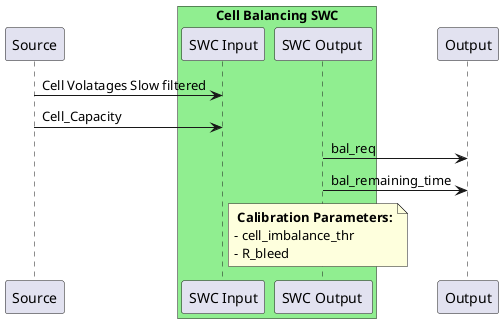

# Cell Balancing

The purpose of cell balancing is to balance the energy between the different cells within a pack. In this document, we will only consider passive cell balancing, where a resistor called a bleeding resistor "wastes" energy
from one or multiple cell to align the energy content between all the cells in a pack.

Note: The soc may be inaccurate during the balancing depending on the value of the bleeding resistor. Therefore one must ignore the OCV reading during balancing and keep track of the bleeding current.

## 1. Preconditions:

### a. Cell balancing in linear OCV regions:

Since LFP cells have a flat OCV in some regions, we will restrict cell balancing to the OCV linear regions (i.e. low and high soc levels).
In those regions, the BMS is reading the open circuit voltage to determine the soc and therefore the energy content of the cell.

### b. Voltage difference and low current:

In those regions and at relaxation, detect if there is an imbalance:
- Difference between Vmin and Vmax is >= cell_imbalance_thr V (default 20mV).

If there is an imbalance, identify which cell(s) need balancing:
- All the cell(s) whose voltage is >= cell_imbalance_thr V

The balancing shall stop if the BMS detect a current high enough to compromise the relaxation (see relaxation parameters in Soc estimation).

## 2. Balancing time estimate:

### a. Energy to be bled

Now that we have identified all the cells (by id) that need to be balanced, we need to calculate how much energy need to be extracted in each of them:
E_bal = (CellOCV - Vmin)*Cell_capacity 
Note: E_bal is in Wh, therefore the cell capacity needs to be in Ah.

### b. Timing:

In order to know for how long we shall request cell balancing, we need to take into consideration the bleeding resistor power. Using a simple estimate, one can derive the bleeding power as:
P_bleed = R_bleed.I^2 = CellOCV^2 /R_bleed. Where R_bleed is the bleeding resistor value and CellOCV is the cell open circuit voltage.
I_bleed = CellOCV/R_bleed (estimation).
Here we assume that the cell voltage remains constant, which is not true throughout the balancing procedure.

A bleeding timing is then obtained by:
Dt_bleed = E_bal / P_bleed
Note: the unit above is in hour and can be changed to seconds if needed.

### c. Soc correction:

For the cells that are being bled, one must keep track of their respective soc. Once the balancing starts, the soc for those cells should be based on a coulomb counting where the current is
the estimated bleeding current I_bleed, which is a constant value throughout the balancing session:
Soc(k) = Soc(k-1) + I_bleed.Ts/Q_cell
Where Ts is the sampling time of the cell balancing, Q_cell is the cell capacity.
When the balancing is over, wait for the cells to relax (see relaxation requirement) to switch back to OCV soc estimation.
Note: if the relaxation is compromised (shunt value is higher than threshold), one must then switch to a normal coulomb counting.

### d. Balancing request:

The bal_req signal is to be sent to the identified cells during resp. Dt_bleed seconds.

-------------------------------------------------------------------------------------------------------------------------------------------------------------------------------------------------------------------------
# TESTING
-------------------------------------------------------------------------------------------------------------------------------------------------------------------------------------------------------------------------

# 1. Normal condition:
- In a pack, provok an imbalance by discharging one cell only such that the cell voltage at rest at least cell_imbalance_thr (default 20mV) less than the other cells.
- Keep track of the energy/capacity that was removed, x Ah.
- Bring the cells to a Soc where the OCV curve is linear (higher or lower region).
- Keep shunt current to 0A throughout the balancing session.
- Start the BMS.
- ✅ Observe: the BMS shall trigger cell balancing for all the other cells. The balancing time Dt_bleed, should match = (x.CellV) / P_bleed.
- ✅ Observe: that the SOC is consistent when the balancing starts (no jumps) and that the soc all the cells that are balanced are approaching the soc of the cell that is not balanced.
- ✅ Check: after Dt_bleed, all the cell should have the same SoC and the same resting voltage.
Once the balancing is over, wait for the cells to fully relax.
- ✅ Check: the Soc does not jump too much when switching to OCV-SOC estimation.

# 2. Interruption:
- In a pack, provok an imbalance by discharging one cell only such that the cell voltage at rest at least cell_imbalance_thr (default 20mV) less than the other cells.
- Keep track of the energy/capacity that was removed, x Ah.
- Bring the cells to a Soc where the OCV curve is linear (higher or lower region).
- Keep shunt current to 0A throughout the balancing session.
- Start the BMS.
- ✅ Observe: the BMS shall trigger cell balancing for all the other cells. The balancing time Dt_bleed, should match = (x.CellV) / P_bleed.
- ✅ Observee: that the SOC is consistent when the balancing starts (no jumps).
- Half way through the balancing, charge or discharge the pack with a current > relaxation threshold current.
- ✅ Observe: the balancing should stop.
- ✅ Check: there are no Soc jumps and that Soc is now based on coulomb counting.
