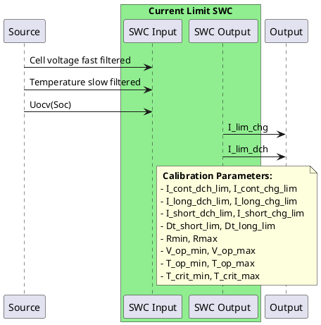

# Current Limits

## Parameters
| Parameter | Value | Description |
|-----------|-------|-------------|
| `I_cont_dch_lim`, `I_cont_chg_lim` | -72A, 72A | Continuous discharge/charge limits |
| `I_long_dch_lim`, `I_long_chg_lim` | -144A, 144A | Long pulse discharge/charge limits |
| `I_short_dch_lim`, `I_short_chg_lim` | -216A, 216A | Short pulse discharge/charge limits |
| `Dt_short_lim`, `Dt_long_lim` | 30s, 3min | Short and long pulse time limits |
| `Rmin`, `Rmax` | 0.1mΩ, 0.5mΩ | Minimum and maximum resistance |
| `V_op_min`, `V_op_max` | 2.5V, 3.65V | Operating voltage limits |
| `T_op_min`, `T_op_max` | 5°C, 38°C | Operating temperature limits |
| `T_crit_min`, `T_crit_max` | 0°C, 45°C | Critical temperature limits |

> **Note:** Sign convention - charge current is positive, discharge current is negative. In this document 'x' refers to charge or discharge.

## Overview

The current limits are layered, when respected they ensure that the cell voltage limits are not violated and that the cell ages according to specification.

- **Recommended current limits** come into play while operating far away from the cell cut-off voltages `V_op_min`, `V_op_max` respectively (2.8V and 3.65V for LFP).
- **Hard limits** are based on maximum and minimum operating voltages. These voltages should not be exceeded as they will lead to a premature wear of the cell.

> **Important:** The hard limits are not to be confused with the safety limits. The safety limits (typ. 2V and 3.8V on LFP) are the absolute voltage limits, violating these will lead to irreversible damage to the cell.

## 1. Recommended Current Limits (`I_rec_x`)

These limits are typically provided by the cell manufacturer and guarantee the lifetime of the cell. They come as a form of lookup tables and datasheets and will vary significantly from cell to cells.

### a. Continuous Current Limit Parameters (`I_cont_chg_lim`, `I_cont_dch_lim`)

The cell manufacturer provides a continuous current that can be used without interruption for an indefinite amount of time, `I_cont_dch_lim`. The same applies for charge `I_cont_chg_lim`. This is only valid within the normal temperature operating ranges [`T_op_min`; `T_op_max`].

### b. Dynamic Continuous Current Limits (`I_cont_chg`, `I_cont_dch`)

When exceeding the operating temperature range, the dynamic continuous power limit should linearly go to 0A between `T_op_max` and `T_crit_max`, respectively `T_op_min` and `T_crit_min`.

### c. Short/Long Pulse Current Limit Parameters

The cell manufacturer provides as well a maximum discharge/charge current for:

- **Short pulse:** `I_short_dch_lim`, `I_short_chg_lim` and `Dt_short_lim` (typically 30s)
- **Long pulse:** `I_long_dch_lim`, `I_long_chg_lim` and `Dt_long_lim` (typically 3-5min)

These are calibration parameters.

### d. Dynamic Current Limits (`I_long_x`, `I_short_x`)

**Continuous Operation:**
- When the current is equal or below the continuous limit, there is no time limit for how long it can be used.

**Long Pulse Operation:**
- When the current goes above the continuous limit and below the long pulse, the current excess `Abs(current - continuous current limit)` is integrated over time and the dynamic current limit `I_long_x = I_long_x_lim`.
- When the integral reaches `I_long_x_lim * Dt_long_lim`, then the current limit `I_long_x` falls to continuous limit.
- **Note:** The integral needs to recover by having the current going below the continuous limit for a certain amount of time.

**Short Pulse Operation:**
- When the current goes above the long pulse and below or equal to the short pulse, the current excess `Abs(current - long current limit)` is integrated over time and the dynamic current limit `I_short_x = I_short_x_lim`.
- When the integral reaches `I_short_x_lim * Dt_short_lim`, then the current limit `I_short_x` falls to long limit.
- **Note:** The integral needs to recover by having the current going below the long limit for a certain amount of time.

**Temperature Dependencies:**
- If the maximum temperature gets close to `T_op_max`, both `I_short_chg` and `I_long_chg` should converge rapidly towards `I_cont_chg`.
- If the minimum temperature gets close to `T_op_min`, both `I_short_dch` and `I_long_dch` should converge rapidly towards `I_cont_dch`.

### e. Recommended Current Limits Calculation (`I_rec_x`)

Finally, the recommended current limit charge and discharge:

```
I_rec_chg = max(I_cont_chg_lim, I_long_chg, I_short_chg)
I_rec_dch = min(I_cont_dch_lim, I_long_dch, I_short_dch)
```

> **Important:** 
> - Current limit charge `I_rec_chg` should always be ≤ `I_short_chg_lim`
> - Current limit discharge `I_rec_dch` should always be ≥ `I_short_dch_lim`

> **Note:** The above algorithm runs only based on current and can therefore run per pack (not per cell).

## 2. Hard Limits (`I_hrd_x`)

These limits predict the maximum/minimum currents that can be used before the cell reaches its max/min operating voltage limits `V_op_max`, `V_op_min`. These limits are usually relevant when reaching high and low SoC levels.

### Zero Order Cell Model

The simplest way of ensuring that the operating voltage limits are never hit is to consider a zero order cell model:

```
V_cell(k+1) = U_ocv(k) + R(k) × I_hrd_x(k)
```

Where:
- `R(k)` is the internal resistance of the cell for a given SoC and temperature (also called DCIR)
- `R(k)` is unknown but from the specifications its value is normally between [`Rmin`; `Rmax`]
- `U_ocv(k)` is obtained by using the SoC on the inverse OCV table

### Hard Limit Calculations

For charge limit where `V_cell(k+1) = V_op_max`:
```
V_cell(k+1) = U_ocv(k) + Rmax × I_hrd_chg(k)
I_hrd_chg(k) = [V_op_max - U_ocv(Soc(k))] / R(k)
```

For discharge limit:
```
I_hrd_dch(k) = [V_op_min - U_ocv(Soc(k))] / R(k)
```

`R(k)` can be initialized to the middle value of the [`Rmin`; `Rmax`] range.

### Resistance Correction

When reaching (or over-reaching) the cell operation limit `V_op_max` one can correct `R(k)`:
```
R(k) = [V_cell(k) - U_ocv(Soc(k))] / I_hrd_chg(k)
```

This value can then be used immediately to correct `I_hrd_chg(k)`. This loop will ensure that the cell voltage does not exceed `V_op_max` for a prolonged amount of time. The same applies to cell operation limit `V_op_min`.

> **Note:** The above algorithm runs per cell as each cell has its own individual resistance and U_ocv. This means that there will be N `I_hrd_x` limits, we are only interested in the extreme of these limits:
> - `I_hrd_chg` will be the minimum of the hard limit charge over all the cells
> - `I_hrd_dch` will be the maximum of the hard limit discharge over all the cells

## 3. Overall Limits (`I_lim_chg`, `I_lim_dch`)

The overall limits are communicated on CAN to the inverter or any load controlling unit.

```
I_lim_chg = min(I_hrd_chg, I_rec_chg)
I_lim_dch = max(I_hrd_dch, I_rec_dch)
```


