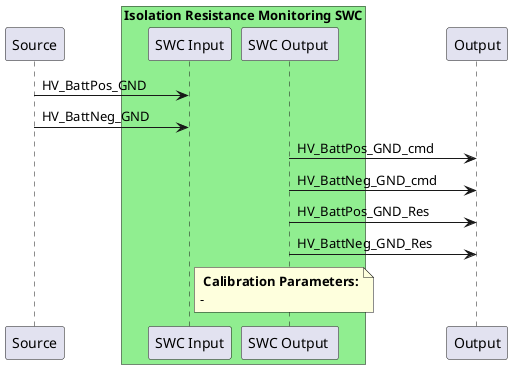

# Isolation Resistance Monitoring

## Background
The IRM is used to ensure that the HV BAT+ is sufficiently isolated from the ground (casing) and that the HV BAT- is also sufficiently isolated from the ground.
A set of measurements is performed by the BMS at startup before closing the contactors.
If the measurement results are showing a low isolation value, the BMS shall not close the contactors and shall report an error.

## Requirement
IEC 62477-1 / IEC 60755 (PCS requirements) states that there needs to be at least 500 Ohm per volt on the high voltage side. E.g. a 300V system would need an isolation of 150 kOhm
This only applies to high voltage systems (i.e. > 60V).

