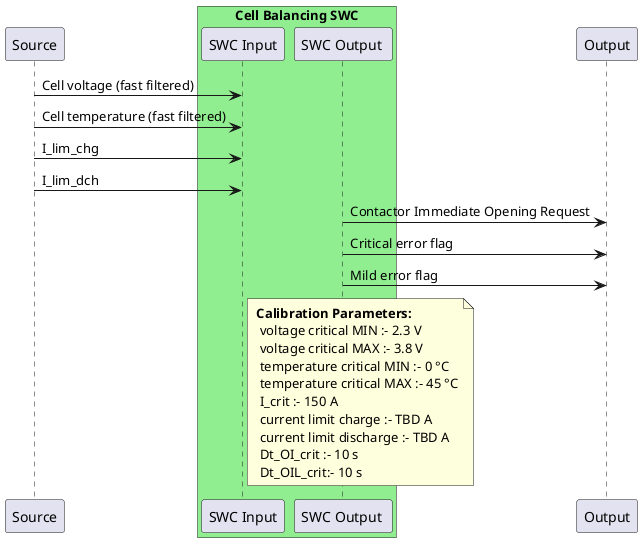

# Limits Violation Protection

The BMS shall detect any violation on any cell of the pack and react as fast as possible to protect the batteries.  
It shall continuously monitor cell voltages and temperatures and act by either opening the contactor and/or reducing the power limits.

---

---

## Cell Voltage Limits

1. **High limit**  
   If any cell voltage (fast filtered) \(> V_{\text{crit,max}}\):  
   - Immediately open all contactors  
   - Throw a critical error

2. **Low limit**  
   If any cell voltage (fast filtered) \(< V_{\text{crit,min}}\):  
   - Immediately open all contactors  

---

## Cell Temperature Limits

1. **High limit**  
   If any cell temperature (fast filtered) \(> T_{\text{crit,max}}\):  
   - Immediately open all contactors  
   - Throw a critical error

2. **Low limit**  
   If any cell temperature (fast filtered) \(< T_{\text{crit,min}}\):  
   - Immediately open all contactors  
   - Throw a critical error

## Pack current
   If the pack current (in absolute value) goes above I_crit for Dt_OI_crit seconds then the BMS shall open the contactors and throw a mild error.
   This limit corresponds to the maximum current the pack, busbar and contactors can take.

## Current limits
   If the pack current (in absolute value) goes above I_lim_chg for Dt_OIL_crit seconds then the BMS shall open the contactors and throw a mild error.
   If the pack current (in absolute value) goes above I_lim_dch for Dt_OIL_crit seconds then the BMS shall open the contactors and throw a mild error.
   
---

## Testing Procedure

> **Note:** Testing should be done with fake limits to avoid damaging cells.

### Voltage Limits

- **High Limit Test**
  1. Set cell voltage to ~3–3.2 V  
  2. Set `V_crit_max` to 3.5 V  
  3. Slowly charge the cell until it reaches 3.5 V (current < 10 A)  

- **Low Limit Test**
  1. Set cell voltage to ~3–3.2 V  
  2. Slowly discharge the cell until it crosses 2.9 V (current < 10 A)  

---

### Current Limits

- **Charge Limits**
  1. Adjust `T_crit_min` and `T_crit_max` close to actual cell temperature  

- **Discharge Limits**
  1. **Observe:** Contactors open immediately upon crossing limits  

---

