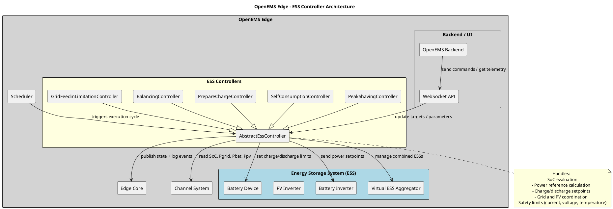

```puml
@startuml
title OpenEMS Edge - ESS Controller Architecture

skinparam componentStyle rectangle
skinparam packageStyle rectangle
skinparam defaultTextAlignment center

package "OpenEMS Edge" #LightGray {
  
  [Edge Core] as core
  [Channel System] as channels
  [Scheduler] as scheduler
  
  package "Energy Storage System (ESS)" #LightBlue {
    [Battery Device] as batteryDevice
    [Battery Inverter] as batteryInverter
    [PV Inverter] as pvInverter
    [Virtual ESS Aggregator] as virtualEssAggregator
  }

  package "ESS Controllers" #LightYellow {
    [AbstractEssController] as abstractEssController
    [PeakShavingController] as peakShavingController
    [SelfConsumptionController] as selfConsumptionController
    [PrepareChargeController] as prepareChargeController
    [BalancingController] as balancingController
    [GridFeedinLimitationController] as gridFeedinLimitationController
  }

  package "Backend / UI" #LightGray {
    [OpenEMS Backend] as backend
    [WebSocket API] as websocketApi
  }
}

' Relationships
scheduler --> abstractEssController : triggers execution cycle
abstractEssController --> channels : read SoC, Pgrid, Pbat, Ppv
abstractEssController --> batteryDevice : set charge/discharge limits
abstractEssController --> batteryInverter : send power setpoints
abstractEssController --> virtualEssAggregator : manage combined ESSs
abstractEssController --> core : publish state + log events

peakShavingController -down-|> abstractEssController
selfConsumptionController -down-|> abstractEssController
prepareChargeController -down-|> abstractEssController
balancingController -down-|> abstractEssController
gridFeedinLimitationController -down-|> abstractEssController

backend --> websocketApi : send commands / get telemetry
websocketApi --> abstractEssController : update targets / parameters

note bottom of abstractEssController
Handles:
- SoC evaluation
- Power reference calculation
- Charge/discharge setpoints
- Grid and PV coordination
- Safety limits (current, voltage, temperature)
end note

@enduml
```