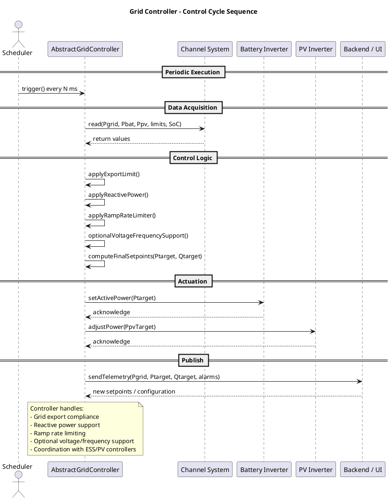

```puml
@startuml
title Grid Controller - Control Cycle Sequence

actor "Scheduler" as scheduler
participant "AbstractGridController" as controller
participant "Channel System" as channels
participant "Battery Inverter" as batteryInverter
participant "PV Inverter" as pvInverter
participant "Backend / UI" as backend

== Periodic Execution ==
scheduler -> controller : trigger() every N ms

== Data Acquisition ==
controller -> channels : read(Pgrid, Pbat, Ppv, limits, SoC)
channels --> controller : return values

== Control Logic ==
controller -> controller : applyExportLimit()
controller -> controller : applyReactivePower()
controller -> controller : applyRampRateLimiter()
controller -> controller : optionalVoltageFrequencySupport()
controller -> controller : computeFinalSetpoints(Ptarget, Qtarget)

== Actuation ==
controller -> batteryInverter : setActivePower(Ptarget)
batteryInverter --> controller : acknowledge
controller -> pvInverter : adjustPower(PpvTarget)
pvInverter --> controller : acknowledge

== Publish ==
controller -> backend : sendTelemetry(Pgrid, Ptarget, Qtarget, alarms)
backend --> controller : new setpoints / configuration

note over controller
Controller handles:
- Grid export compliance
- Reactive power support
- Ramp rate limiting
- Optional voltage/frequency support
- Coordination with ESS/PV controllers
end note
@enduml

```