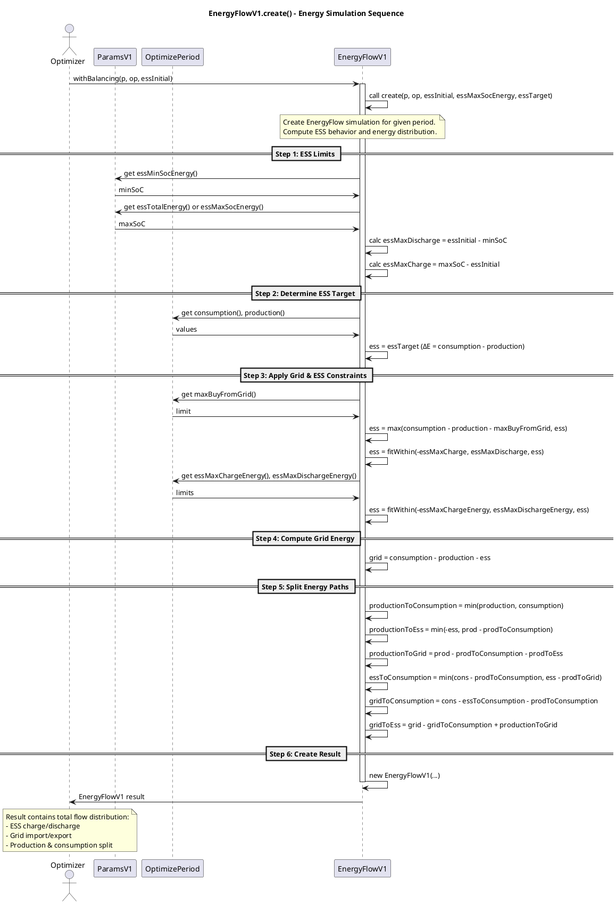

# Energy Flow 

```puml
@startuml
title EnergyFlowV1.create() - Energy Simulation Sequence

actor "Optimizer" as OPT
participant "ParamsV1" as P
participant "OptimizePeriod" as OP
participant "EnergyFlowV1" as FLOW

OPT -> FLOW : withBalancing(p, op, essInitial)
activate FLOW
FLOW -> FLOW : call create(p, op, essInitial, essMaxSocEnergy, essTarget)

note over FLOW
Create EnergyFlow simulation for given period.
Compute ESS behavior and energy distribution.
end note

== Step 1: ESS Limits ==
FLOW -> P : get essMinSocEnergy()
FLOW <- P : minSoC
FLOW -> P : get essTotalEnergy() or essMaxSocEnergy()
FLOW <- P : maxSoC
FLOW -> FLOW : calc essMaxDischarge = essInitial - minSoC
FLOW -> FLOW : calc essMaxCharge = maxSoC - essInitial

== Step 2: Determine ESS Target ==
FLOW -> OP : get consumption(), production()
FLOW <- OP : values
FLOW -> FLOW : ess = essTarget (ΔE = consumption - production)

== Step 3: Apply Grid & ESS Constraints ==
FLOW -> OP : get maxBuyFromGrid()
FLOW <- OP : limit
FLOW -> FLOW : ess = max(consumption - production - maxBuyFromGrid, ess)
FLOW -> FLOW : ess = fitWithin(-essMaxCharge, essMaxDischarge, ess)
FLOW -> OP : get essMaxChargeEnergy(), essMaxDischargeEnergy()
FLOW <- OP : limits
FLOW -> FLOW : ess = fitWithin(-essMaxChargeEnergy, essMaxDischargeEnergy, ess)

== Step 4: Compute Grid Energy ==
FLOW -> FLOW : grid = consumption - production - ess

== Step 5: Split Energy Paths ==
FLOW -> FLOW : productionToConsumption = min(production, consumption)
FLOW -> FLOW : productionToEss = min(-ess, prod - prodToConsumption)
FLOW -> FLOW : productionToGrid = prod - prodToConsumption - prodToEss
FLOW -> FLOW : essToConsumption = min(cons - prodToConsumption, ess - prodToGrid)
FLOW -> FLOW : gridToConsumption = cons - essToConsumption - prodToConsumption
FLOW -> FLOW : gridToEss = grid - gridToConsumption + productionToGrid

== Step 6: Create Result ==
FLOW -> FLOW : new EnergyFlowV1(...)
deactivate FLOW
OPT <- FLOW : EnergyFlowV1 result

note over OPT
Result contains total flow distribution:
- ESS charge/discharge
- Grid import/export
- Production & consumption split
end note

@enduml


```
