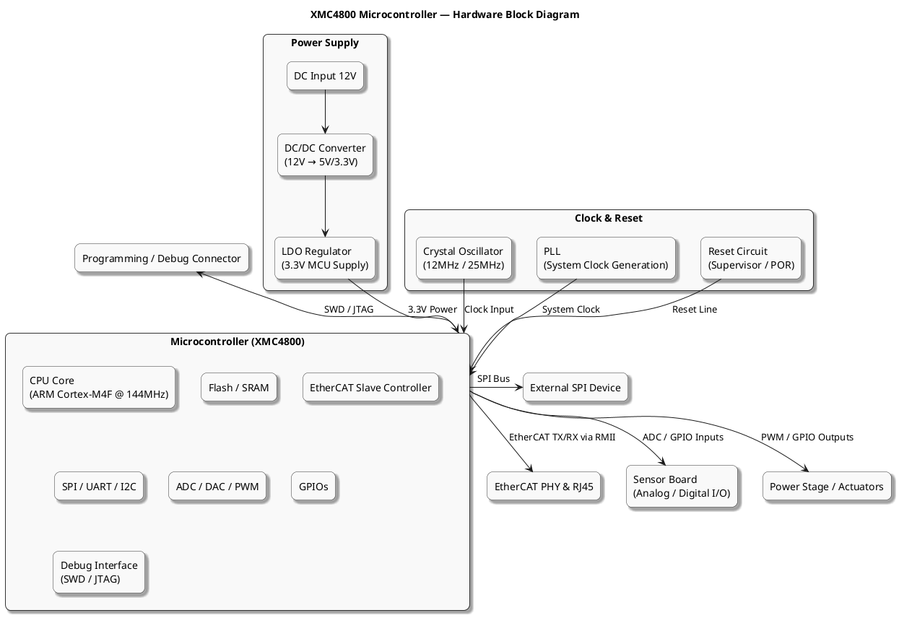

# 🦅 Falcon Board — Technical Specification

## Overview
**Falcon** is a high-performance control and communication board based on the **Infineon XMC4800** microcontroller.  
It is designed for industrial automation and embedded applications, supporting **EtherCAT**, **Ethernet**, **CAN**, and multiple peripheral interfaces for flexible connectivity.

---

## Electrical Specifications

| Parameter | Description |
|------------|-------------|
| **Operating Voltage** | 5 V DC |
| **Logic Level** | 3.3 V (for all GPIOs) |
| **Microcontroller** | Infineon XMC4800 Series |
| **Power Input** | 5 V regulated input through connector or external source |

---

## Communication Interfaces

| Interface | Description |
|------------|-------------|
| **EtherCAT** | Dual-port EtherCAT (IN & OUT) for real-time industrial communication |
| **Ethernet** | Standard Ethernet interface for network and IoT connectivity |
| **CAN** | Single-channel CAN interface for industrial communication and control networks |
| **SPI** | - 2 × SPI Channels for peripheral communication - 1 × Dedicated SPI Channel for external device interface |
| **I²C** | Single-channel I²C interface for sensor or peripheral communication |
| **UART** | Single UART channel for serial data communication and debugging |

---

## General Features

- Powered by **Infineon XMC4800** with integrated EtherCAT and CAN support  
- Operates at **5 V** with **3.3 V logic** for all digital I/O  
- Multiple serial communication interfaces for diverse connectivity  
- Compact, modular, and reliable design suitable for industrial use  
- Designed for easy integration with external devices and expansion boards  

---

## Applications

- Industrial Automation Controllers  
- Communication Gateways  
- Motion Control Systems  
- CAN-Based Control Units  
- Data Acquisition Modules  
- Research and Development Platforms  

---

## Future Enhancements (Optional)

- Support for additional communication buses (LIN, RS485)  
- Extended memory and storage options  
- Modular connector interface for stacking expansion boards  

---

*Falcon – Powered by Infineon XMC4800 for next-generation industrial connectivity.*
