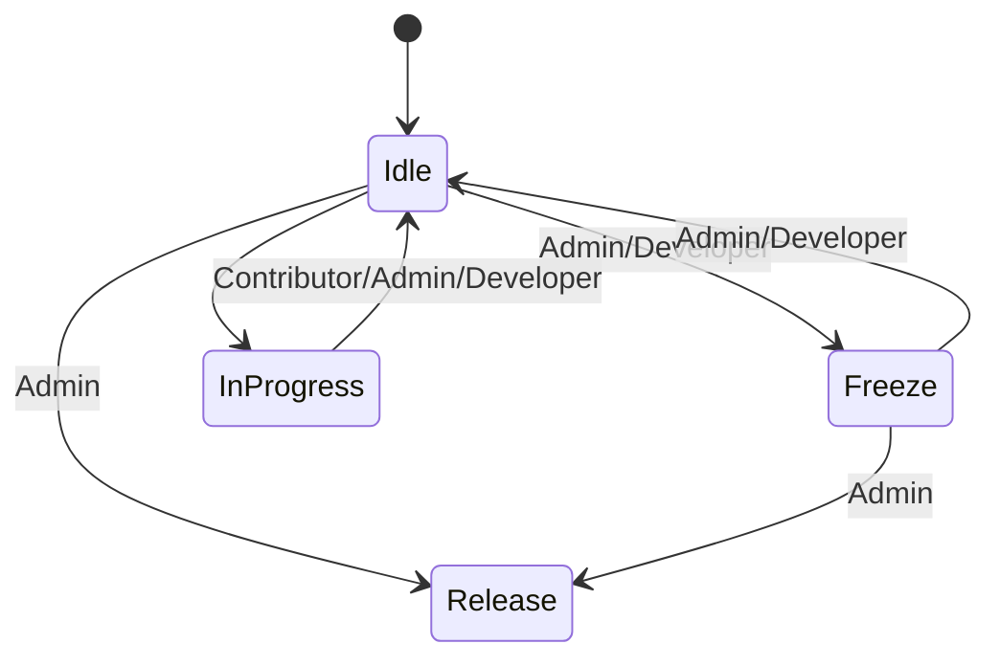

# Issue #306: State Management API

**Repository:** esysflow  
**Status:** Open  
**Created:** 2025-07-13  
**Updated:** 2025-07-14  
**Author:** @harish-ramar  
**Assignees:** @harish-ramar  
**Labels:** `API Call`  

[View on GitHub](https://github.com/Simtestlab/esysflow/issues/306)

## Description

# State API Documentation

## Overview
Single endpoint to manage branch states with proper permission validations. States include: Idle, Freeze, In Progress, and Release.

---
## API Endpoints

### 1. Update Branch State
```http
PUT /api/state
```

**Request Body**:
```json
{
  "state": "freeze | idle",
  "user": "user-id",
  "project": "project-id",
  "branch": "branch-id",
  "updatedAt": "current-timestamp"
}
```

**Permissions**:
It can be handled based on the access API endpoints

---

### 2. Get Current State
```http
GET /api/state
```

**Response**:
```json
{
  "currentState": "string",
  "lastUpdated": "ISO-8601 datetime",
  "lastUpdatedBy": "userId",
}
```

---

## State Details

### State Transition Rules


### State Behaviors
1. **Idle**
   - Default available state
   - Can be transitioned to from Freeze or In Progress

2. **Freeze**
   - Requires Admin/Developer role
   - Makes branch read-only
   - Can be unfrozen back to Idle

3. **In Progress**
   - Requires at least Contributor role
   - Must include activity description
   - Automatically returns to Idle when branch is closed

4. **Release**
   - Requires Admin role
   - Terminal state (no further modifications)
   - Makes all files permanently read-only
   - Allows new branches to be created from it
---