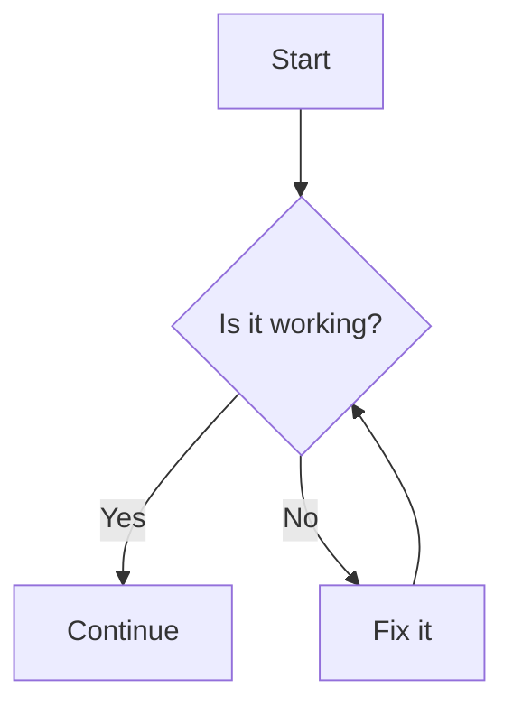
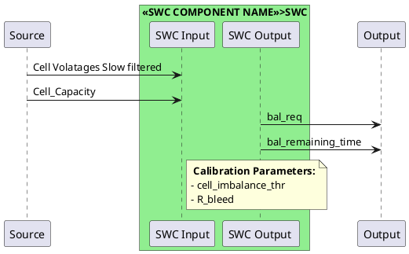

# Help Menu

Welcome to the **Documentation Help Menu**!  
This page shows examples of diagrams, math equations, and code formatting supported in this MkDocs site.

---

## 1. Flowcharts with Mermaid

Mermaid allows you to create flowcharts, sequence diagrams, and more.
<div class="mermaid-code-container">
```python
    ```mermaid
    graph TD
        A[Start] --> B{Is it working?}
        B -- Yes --> C[Continue]
        B -- No --> D[Fix it]
        D --> B
    ```
```


</div>


## 2. How to draw UML diagrams for SWC with PlantUML

You could use PlantUML to draw UML diagrams for SWC. Below is an example of a simple component diagram for a Cell Balancing SWC.
<div class="mermaid-code-container">
```python
@startuml

' External signal sources (left)
participant "Source" as Inputs

' SWC in the middle   
box "<<SWC COMPONENT NAME >>>SWC" #LightGreen
  participant "SWC Input" as In
  participant "SWC Output " as Out
  
end box

' Signals into SWC ############################# EDIT ONLY HERE #############################
Inputs -> In : Cell Volatages Slow filtered
Inputs -> In : Cell_Capacity

' Signals from SWC ##########################  EDIT ONLY HERE ################################
Out -> Output : bal_req
Out -> Output : bal_remaining_time


' Signals from SWC ##########################  EDIT ONLY HERE ################################
note right of In 
    <b> Calibration Parameters:</b>
    - cell_imbalance_thr
    - R_bleed
end note


@enduml
```
</div>


## Thats will look like this:

