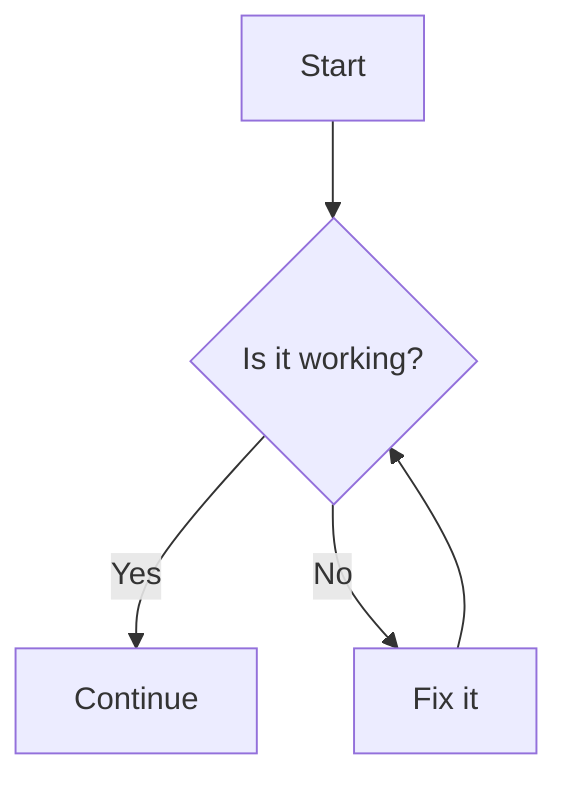

# Help Menu

Welcome to the **Documentation Help Menu**!  
This page shows examples of diagrams, math equations, and code formatting supported in this MkDocs site.

---

## 1. Flowcharts with Mermaid

Mermaid allows you to create flowcharts, sequence diagrams, and more.
<div class="mermaid-code-container">
```python
    ```mermaid
    graph TD
        A[Start] --> B{Is it working?}
        B -- Yes --> C[Continue]
        B -- No --> D[Fix it]
        D --> B
    ```
```


</div>